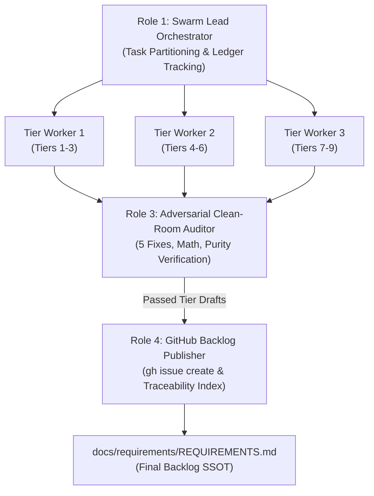

# TEAMWORK SWARM CHARTER: DEAP COMPILER REQUIREMENTS ELABORATION & BACKLOG PUBLICATION

## 1. Prime Mission Directive & System Context

- **System Identity:** Sovereign DEAP Compiler (`deap-compiler`).
- **Workspace Context:** Clean-room repository root (`/Users/perkunas/jail/deap-compiler`).
- **Seed Input:** `REQUIREMENTS_SKELETON.md` (120 seed requirements covering Tiers 1 through 9).
- **Core Mission:** Deploy an autonomous multi-agent swarm via `/teamwork-preview` to ingest the 120 seed requirements, expand each into an exhaustive, contract-grade IEEE 29148 specification block using the mandatory 4-part Detailing Template, apply the 5 Non-Negotiable Architectural Fixes, audit each draft for zero domain contamination and mathematical rigor, and publish all 120 requirements as formal tracked issues on GitHub via the `gh` CLI.
- **Phase Boundary:** Specification formalization and backlog tracking ONLY. Writing Rust implementation code, creating crates, or generating mock implementations is strictly prohibited during this phase.

---

## 2. Inviolable Clean-Room Invariants

Every agent in the swarm MUST strictly enforce these four zero-compromise rules:

1. **Pure Schema-Driven Compiler (Zero Hardcoded Domain Concepts):**
   The compiler is an abstract Model-Based Systems Engineering (MBSE) compiler and formal verification engine. It operates exclusively on generic systems engineering primitives: Classifiers, Ports, Connectors, Rational Dimensional Exponents, Kirchhoff Flow Networks, and Temporal Intervals. All entities, signals, physical bounds, and units derive deterministically from user-supplied schemas. Every example, scenario, or parameter must use purely synthetic abstract placeholders (e.g., `Package_0`, `Classifier_Alpha`, `Port_1`, `Flow_A`, `param_x : Real`).
2. **The Zero Mock-Data Imperative:**
   Under no circumstances shall any elaborated requirement contain hypothetical or fabricated real-world physical systems. All illustrative examples must use purely abstract mathematical placeholders (e.g., `Classifier_Alpha`, `Port_1`, `[M]^1 [L]^2`).
3. **Pure KaTeX Display Math:**
   All display mathematical equations must be enclosed in isolated `$$` fences on dedicated lines; multi-line equations must use `\begin{aligned} ... \end{aligned}`. Non-mathematical identifiers must never use math delimiters.
4. **Zero Unicode Em Dashes:**
   ASCII `--` or `-` exclusively across all issue titles, bodies, and labels. Unicode em dashes (`\u2014`) are strictly prohibited.

---

## 3. The 5 Non-Negotiable Architectural Directives

During requirement detailing, the swarm must enforce these five specific architectural fixes:

1. **Deterministic UUIDv5 Anchors (REQ-091, REQ-098, REQ-105):**
   Replace all references to "UUIDv7" with **"Deterministic UUIDv5"** (RFC 4122 namespace hashing seeded by a fixed namespace OID and the node's fully qualified topological path, e.g., `Package_A::Part_B`) to preserve bitwise determinism and Merkle root digests. Time-based UUIDs are strictly banned.
2. **Bounded Work-Stealing Parallelism (REQ-075):**
   Multithreading for STPA Cartesian hazard expansions must be implemented exclusively via a **bounded, work-stealing thread pool** (e.g., `rayon`). Unbounded manual thread spawning (`std::thread::spawn` per node) is strictly banned.
3. **String Interner Memory Allocation Exception (REQ-028):**
   Explicitly specify in REQ-028 that copying string bytes from the source file buffer into the global interner pool during the initial lexical pass is the **sole permitted exception** to the zero-copy invariant.
4. **Synchronization Token Error Recovery (REQ-011):**
   In REQ-011, mandate that the ingestion engine implements **Synchronization Token Error Recovery** to resynchronize on record/delimiter boundaries and accumulate multiple diagnostics per file rather than aborting on first fault.
5. **Panic-Free Production Paths & Benchmarking Isolation (REQ-114, REQ-115, REQ-119):**
   Production compiler library code must be **100% panic-free** (`.unwrap()` and `.expect()` banned; errors propagated via `Result`). Performance latency (REQ-114) and RSS memory (REQ-115) gates must be evaluated **exclusively in compiled Release mode (`--release`)** via dedicated benchmarking harnesses (e.g., `criterion`), isolated from standard CI logic tests.

---

## 4. Multi-Agent Swarm Topology & Role Assignments



- **Role 1: Swarm Lead Orchestrator:** Ingests `REQUIREMENTS_SKELETON.md`, partitions the 120 requirements into 9 Tier batches, tracks batch status in `.teamwork/status_ledger.json`, coordinates handoffs, and compiles the final `REQUIREMENTS.md`.
- **Role 2: Tier Detailing Workers:** Parallel subagents ingesting assigned Tier batches from `REQUIREMENTS_SKELETON.md`, applying the 5 Directives, and writing expanded 4-part blocks to `.teamwork/drafts/tier_<NN>_elaborated.md`.
- **Role 3: Adversarial Clean-Room & Mathematical Auditor:** Rejects any draft with domain leaks, mock data, "UUIDv7", unbounded threads, unisolated `$$`, or Unicode em dashes.
- **Role 4: GitHub Backlog Publisher:** Reads certified drafts, writes each body to a temporary file, and executes `gh issue create` using `--body-file` to prevent bash escaping errors.

---

## 5. Mandatory 4-Part Detailing Schema

Every single one of the 120 requirements (`REQ-001` through `REQ-120`) MUST be elaborated using this exact Markdown template:

```markdown
### [REQ-XXX]: [Requirement Title]
**Description:** [1-3 concise sentences defining the exact compiler behavior, inputs, and outputs]
**Mathematical / Logical Invariant:** [Formal mathematical formula, O(N) complexity bound, topological graph property, or boolean state invariant. Use KaTeX with isolated $$ fences. If strictly structural, state N/A]
**Acceptance Criteria:**
- **AC-1:** [Concrete, unambiguous verification condition, e.g., The compiler shall emit diagnostic E0XXX if...]
- **AC-2:** [Structural / data invariant condition, e.g., The AST node arena must preserve...]
- **AC-3:** [Edge case / error recovery condition]
**Implementation Constraint:** [Rust-specific architectural and memory boundary, e.g., "Must use Copy-able `SymbolId` index handles", "Must not invoke `.unwrap()` or `.expect()` in production paths", "Must allocate via generational arena"]
```

---

## 6. The 9-Tier Work Breakdown Structure (Ingest from `REQUIREMENTS_SKELETON.md`)

The swarm must ingest titles and initial descriptions directly from `REQUIREMENTS_SKELETON.md`, partitioning as follows:

- **Tier 1 (REQ-001 to REQ-010, 10 items):** System Invariants & Execution Contract.
- **Tier 2 (REQ-011 to REQ-025, 15 items):** Schema Ingestion & Grammar Parsers. *(Apply Directive 4: Sync token recovery on REQ-011)*.
- **Tier 3 (REQ-026 to REQ-040, 15 items):** Core Metamodel & Intermediate Representation. *(Apply Directive 3: String interner byte copy exception on REQ-028)*.
- **Tier 4 (REQ-041 to REQ-055, 15 items):** Semantic Analysis, Scoping & Type System.
- **Tier 5 (REQ-056 to REQ-070, 15 items):** Physical Quantities, Units & Dimensions ($\mathbb{Q}^7$).
- **Tier 6 (REQ-071 to REQ-080, 10 items):** System Safety & Formal Assurance. *(Apply Directive 2: Work-stealing thread pool on REQ-075)*.
- **Tier 7 (REQ-081 to REQ-090, 10 items):** Interface Control Document Synthesis ($N^2$ matrix, 10-column signal dictionary).
- **Tier 8 (REQ-091 to REQ-105, 15 items):** Downstream Specification Projection & Output Contracts. *(Apply Directive 1: Deterministic UUIDv5 on REQ-091, REQ-098, REQ-105)*.
- **Tier 9 (REQ-106 to REQ-120, 15 items):** Concurrency, Assurance & Quality Gates. *(Apply Directive 5: Release mode criterion benchmarks on REQ-114/115; 100% panic-free on REQ-119)*.

---

## 7. Five-Phase Swarm Execution Protocol

### Phase 1: Pre-flight Verification & Scaffolding
1. Verify `REQUIREMENTS_SKELETON.md` exists and contains all 120 requirements (`REQ-001` through `REQ-120`).
2. Verify GitHub CLI authentication: `gh auth status && gh issue list --limit 5`.
3. Create workspace scratch directories: `mkdir -p .teamwork/drafts docs/requirements`.

### Phase 2: Parallel Tier Elaboration
1. The Orchestrator assigns Tier batches to Tier Workers.
2. Workers expand requirements into the 4-part template, applying the 5 Directives.
3. Workers output `.teamwork/drafts/tier_01.md` through `.teamwork/drafts/tier_09.md`.

### Phase 3: Adversarial Clean-Room & Mathematical Audit
1. The Auditor reviews each drafted Tier file.
2. Asserts: 120 items present, 4-part template complete, 0 domain concepts, 0 mock data, 0 UUIDv7, 0 unbounded threads, isolated `$$` fences, 0 Unicode em dashes.
3. Upon passing, the Auditor certifies the drafts for publication.

### Phase 4: GitHub Issue Creation & Tracking (Using `--body-file`)
1. The Publisher iterates through certified requirements from `REQ-001` to `REQ-120`.
2. For each requirement, write the 4-part body to a temporary file (`.teamwork/drafts/REQ-XXX_body.md`) and execute:
   ```bash
   gh issue create \
     --title "[REQ-XXX] <Requirement Title>" \
     --body-file ".teamwork/drafts/REQ-XXX_body.md" \
     --label "requirement,tier-<N>,clean-room"
   ```
3. Verifies issue creation via `gh issue view <issue-id>` and appends metadata to `.teamwork/issue_manifest.json`.

### Phase 5: Master Backlog Assembly & Verification
1. Assembles `docs/requirements/REQUIREMENTS.md` with executive statement, traceability table linking all 120 live GitHub issues, and full 4-part bodies.
2. Verifies 120 live GitHub issues and zero diff churn.
3. Emits final completion summary report to the user.
