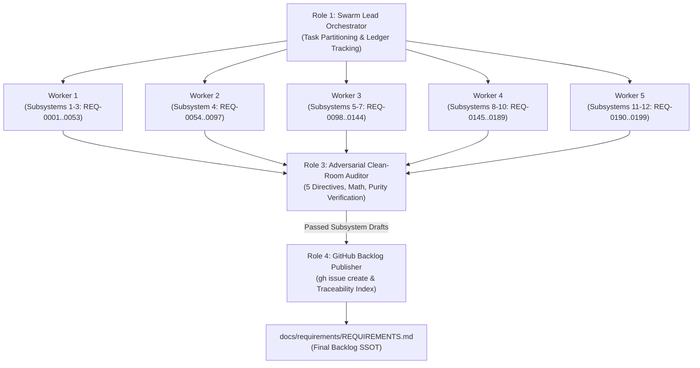

# TEAMWORK SWARM CHARTER: DEAP COMPILER REQUIREMENTS ELABORATION & BACKLOG PUBLICATION

## 1. Prime Mission Directive & System Context

- **System Identity:** Sovereign DEAP Compiler (`deap-compiler`).
- **Workspace Context:** Clean-room repository workspace (`deap-compiler-spec` seed source).
- **Seed Input:** `docs/requirements/REQUIREMENTS_SKELETON.md` and modular skeleton item catalog in `docs/requirements/items/` (199 modular skeleton items covering Subsystems 1 through 12, `REQ-0001` through `REQ-0199`).
- **Core Mission:** Deploy an autonomous multi-agent swarm via `/teamwork-preview` to ingest the 199 modular skeleton items (`REQ-0001` through `REQ-0199`), expand each into an exhaustive, contract-grade IEEE 29148 specification block using the mandatory 4-part Detailing Template, apply the 5 Non-Negotiable Architectural Directives, audit each draft for zero domain contamination and mathematical rigor, and publish all 199 requirements as formal tracked issues on GitHub via the `gh` CLI.
- **Phase Boundary:** Specification formalization and backlog tracking ONLY. Writing implementation code, creating crates, or generating mock implementations is strictly prohibited during this phase.

---

## 2. Inviolable Clean-Room Invariants

Every agent in the swarm MUST strictly enforce these four zero-compromise rules:

1. **Pure Schema-Driven Compiler (Zero Hardcoded Domain Concepts):**
   The compiler is an abstract Model-Based Systems Engineering (MBSE) compiler and formal verification engine. It operates exclusively on generic systems engineering primitives: Classifiers, Ports, Connectors, Rational Dimensional Exponents, Kirchhoff Flow Networks, and Temporal Intervals. All entities, signals, physical bounds, and units derive deterministically from user-supplied schemas. Every example, scenario, or parameter must use purely synthetic abstract placeholders (e.g., `Package_0`, `Classifier_Alpha`, `Port_1`, `Flow_A`, `param_x : Real`).
2. **The Zero Mock-Data Imperative:**
   Under no circumstances shall any elaborated requirement contain hypothetical or fabricated concrete domain models. All illustrative examples must use purely abstract mathematical placeholders (e.g., `Classifier_Alpha`, `Port_1`, `[M]^1 [L]^2`).
3. **Pure KaTeX Display Math:**
   All display mathematical equations must be enclosed in isolated `$$` fences on dedicated lines; multi-line equations must use `\begin{aligned} ... \end{aligned}`. Non-mathematical identifiers must never use math delimiters.
4. **Zero Unicode Em Dashes:**
   ASCII `--` or `-` exclusively across all issue titles, bodies, and labels. Unicode em dashes (`\u2014`) are strictly prohibited.

---

## 3. The 5 Non-Negotiable Architectural Directives

During requirement detailing, the swarm must enforce these five specific architectural fixes:

1. **Deterministic UUIDv5 Anchors (REQ-0010, REQ-0159, REQ-0166, REQ-0173):**
   Replace all references to "UUIDv7" with **"Deterministic UUIDv5"** (RFC 4122 namespace hashing seeded by a fixed namespace OID and the node's fully qualified topological path, e.g., `Package_A::Part_B`) to preserve bitwise determinism and Merkle root digests. Time-based UUIDs are strictly banned.
2. **Bounded Work-Stealing Parallelism (REQ-0012, REQ-0136):**
   Multithreading for STPA Cartesian hazard expansions and parallel AST evaluations must be implemented exclusively via a **bounded, work-stealing thread pool** (bounded worker pool, $N_{\text{max\_workers}}$). Unbounded manual thread spawning (`std::thread::spawn` per node) is strictly banned.
3. **String Interner Memory Allocation Exception (REQ-0036):**
   Explicitly specify in REQ-0036 that copying string bytes from the source file buffer into the global symbol interner pool for scalar `SymbolId` tokens during the initial lexical pass is the **sole permitted exception** to the zero-copy invariant.
4. **Synchronization Token Error Recovery (REQ-0013, REQ-0016):**
   In REQ-0013 and REQ-0016, mandate that the ingestion engine implements **Synchronization Token Error Recovery** to resynchronize on record/delimiter boundaries and accumulate multiple diagnostics per file rather than aborting on first fault.
5. **Panic-Free Production Paths & Benchmarking Isolation (REQ-0011, REQ-0196):**
   Production compiler library code must strictly enforce a **deterministic, non-panicking execution contract** with total-function termination and structured error propagation on invalid inputs. Performance latency (< 25 ms, REQ-0011, REQ-0196) and RSS memory (< 100 MB, REQ-0196) gates must be evaluated **exclusively in compiled Release mode (`--release`)** via dedicated benchmark harnesses, isolated from standard CI logic tests.

---

## 4. Multi-Agent Swarm Topology & Role Assignments



- **Role 1: Swarm Lead Orchestrator:** Ingests `REQUIREMENTS_SKELETON.md` and modular items in `docs/requirements/items/`, partitions the 199 requirements into Subsystem batches, tracks batch status in `.teamwork/status_ledger.json`, coordinates handoffs, and compiles the final `REQUIREMENTS.md`.
- **Role 2: Subsystem Detailing Workers:** Parallel subagents ingesting assigned Subsystem batches from `docs/requirements/items/` and `REQUIREMENTS_SKELETON.md`, applying the 5 Directives, and writing expanded 4-part blocks to `.teamwork/drafts/subsystem_<NN>_elaborated.md`.
- **Role 3: Adversarial Clean-Room & Mathematical Auditor:** Rejects any draft with domain leaks, mock data, "UUIDv7", unbounded threads, unisolated `$$`, or Unicode em dashes.
- **Role 4: GitHub Backlog Publisher:** Reads certified drafts, writes each body to a temporary file, and executes `gh issue create` using `--body-file` to prevent bash escaping errors.

---

## 5. Mandatory 4-Part Detailing Schema

Every single one of the 199 requirements (`REQ-0001` through `REQ-0199`) MUST be elaborated using this exact Markdown template:

```markdown
### [REQ-XXXX]: [Requirement Title]
**Description:** [1-3 concise sentences defining the exact compiler behavior, inputs, and outputs]
**Mathematical / Logical Invariant:** [Formal mathematical formula, O(N) complexity bound, topological graph property, or boolean state invariant. Use KaTeX with isolated `$$` fences. If strictly structural, state N/A]
**Acceptance Criteria:**
- **AC-1:** [Concrete, unambiguous verification condition, e.g., The compiler shall emit diagnostic E0XXX if...]
- **AC-2:** [Structural / data invariant condition, e.g., The AST node arena must preserve...]
- **AC-3:** [Edge case / error recovery condition]
**Implementation Constraint:** [Architectural and memory boundary, e.g., "Must use scalar SymbolId index handles", "Must enforce deterministic non-panicking execution in production paths", "Must allocate via arena storage"]
```

---

## 6. The 12-Subsystem Work Breakdown Structure (Ingest from `REQUIREMENTS_SKELETON.md`)

The swarm must ingest titles and initial descriptions directly from `REQUIREMENTS_SKELETON.md` and modular items in `docs/requirements/items/`, partitioning as follows:

| Subsystem Index & Name | Requirements Range | Count | Primary Compiler Logical Subsystem / Module | Diagnostic Code Space |
| :--- | :---: | :---: | :--- | :---: |
| **Subsystem 1: System Vision, Bootstrapping & Foundational Invariants** | `REQ-0001`--`REQ-0013` | 13 | `deap::compiler` | `E0117--E0130` |
| **Subsystem 2: Universal Schema Ingestion Engine** | `REQ-0014`--`REQ-0033` | 20 | `deap::ingest` | `E0100--E0118, E0131` |
| **Subsystem 3: Core Metamodel, Node Arena & AST Graph Engine** | `REQ-0034`--`REQ-0053` | 20 | `deap::core, deap::ast` | `E0201--E0214, E0229--E0233` |
| **Subsystem 4: Complete OMG SysML v2 / KerML Metamodel Lowering & Grammar** | `REQ-0054`--`REQ-0097` | 44 | `deap::kerml, deap::sysml` | `E0200, E0215--E0228, E0251--E0263, E0301--E0303, E0401--E0404` |
| **Subsystem 5: 7D Physical Metrology & Abstract Flow Conservation Networks** | `REQ-0098`--`REQ-0113` | 16 | `deap::units` | `E0220--E0227, E0262, E0264--E0266, E0304--E0307` |
| **Subsystem 6: Spatio-Temporal Dynamics & Discrete State Machine Solvers** | `REQ-0114`--`REQ-0127` | 14 | `deap::solvers` | `E0226, E0250--E0260, E0405` |
| **Subsystem 7: Formal Safety, Traceability & Regulatory Verification** | `REQ-0128`--`REQ-0144` | 17 | `deap::safety` | `E0130, E0406--E0422, E0440--E0451` |
| **Subsystem 8: Level 1C Interface Control Documents & Interconnect Contracts** | `REQ-0145`--`REQ-0158` | 14 | `deap::spec::icd` | `E0220, E0301, E0440--E0451` |
| **Subsystem 9: Downstream Specification Projections** | `REQ-0159`--`REQ-0174` | 16 | `deap::spec::projections` | `E0112, E0119, E0204, E0210, E0405, E0502--E0510` |
| **Subsystem 10: Multi-Target Code Generation, Simulation & Transport Bindings** | `REQ-0175`--`REQ-0189` | 15 | `deap::codegen` | `E0204, E0228, E0501--E0512` |
| **Subsystem 11: Standardized Compiler Diagnostic Error Catalog** | `REQ-0190`--`REQ-0194` | 5 | `deap::diagnostics` | `E0100--E0599` |
| **Subsystem 12: Compiler Performance, CLI, Assurance & Regression Inoculation** | `REQ-0195`--`REQ-0199` | 5 | `deap::cli` | `E0100--E0599` |
| **TOTAL COMPILER SPECIFICATION** | `REQ-0001`--`REQ-0199` | **199** | **All Core Modules & Pipelines** | `E0100`--`E0599` |

- **Subsystem 1 (REQ-0001 to REQ-0013, 13 items):** System Vision, Bootstrapping & Foundational Invariants. *(Apply Directive 1 on REQ-0010, Directive 5 on REQ-0011, Directive 2 on REQ-0012, Directive 4 on REQ-0013)*.
- **Subsystem 2 (REQ-0014 to REQ-0033, 20 items):** Universal Schema Ingestion Engine. *(Apply Directive 4: Sync token recovery on REQ-0016)*.
- **Subsystem 3 (REQ-0034 to REQ-0053, 20 items):** Core Metamodel, Node Arena & AST Graph Engine. *(Apply Directive 3: String interner byte copy exception on REQ-0036)*.
- **Subsystem 4 (REQ-0054 to REQ-0097, 44 items):** Complete OMG SysML v2 / KerML Metamodel Lowering & Grammar. *(NP-3: Subtyping Lattice & C3 Linearization on REQ-0061..REQ-0063)*.
- **Subsystem 5 (REQ-0098 to REQ-0113, 16 items):** 7D Physical Metrology & Abstract Flow Conservation Networks ($\mathbb{Q}^7$). *(NP-6: Switched Flow MCP on REQ-0105)*.
- **Subsystem 6 (REQ-0114 to REQ-0127, 14 items):** Spatio-Temporal Dynamics & Discrete State Machine Solvers. *(NP-1: Allen Interval Consistency on REQ-0117; NP-5: Orthogonal State Reachability on REQ-0124)*.
- **Subsystem 7 (REQ-0128 to REQ-0144, 17 items):** Formal Safety, Traceability & Regulatory Verification. *(NP-4: STPA Minimal Hazard Cut-Sets on REQ-0135; Directive 2: Work-stealing thread pool on REQ-0136)*.
- **Subsystem 8 (REQ-0145 to REQ-0158, 14 items):** Level 1C Interface Control Documents & Interconnect Contracts. *(NP-2: Structural Allocation & Multi-Dimensional Bin Packing on REQ-0147)*.
- **Subsystem 9 (REQ-0159 to REQ-0174, 16 items):** Downstream Specification Projections. *(Apply Directive 1: Deterministic UUIDv5 on REQ-0159, REQ-0166, REQ-0173)*.
- **Subsystem 10 (REQ-0175 to REQ-0189, 15 items):** Multi-Target Code Generation, Simulation & Transport Bindings. *(NP-7: Register Allocation & Instruction Scheduling on REQ-0180)*.
- **Subsystem 11 (REQ-0190 to REQ-0194, 5 items):** Standardized Compiler Diagnostic Error Catalog. *(Unified Taxonomy E01xx..E05xx on REQ-0191)*.
- **Subsystem 12 (REQ-0195 to REQ-0199, 5 items):** Compiler Performance, CLI, Assurance & Regression Inoculation. *(Apply Directive 5: Latency & RSS Budget Gate on REQ-0196; NP-8: Formal Proof Obligations & Decidable SMT Fragments QF_LRA, QF_LIA, QF_UF on REQ-0197)*.

---

## 7. Five-Phase Swarm Execution Protocol

### Phase 1: Pre-Execution Verification & Scaffolding
1. Verify `REQUIREMENTS_SKELETON.md` and `docs/requirements/items/` exist and contain all 199 requirements (`REQ-0001` through `REQ-0199`).
2. Verify GitHub CLI authentication: `gh auth status && gh issue list --limit 5`.
3. Create workspace scratch directories: `mkdir -p .teamwork/drafts docs/requirements`.

### Phase 2: Parallel Subsystem Elaboration
1. The Orchestrator assigns Subsystem batches to Subsystem Workers.
2. Workers expand requirements into the 4-part template, applying the 5 Directives.
3. Workers output `.teamwork/drafts/subsystem_01.md` through `.teamwork/drafts/subsystem_12.md`.

### Phase 3: Adversarial Clean-Room & Mathematical Audit
1. The Auditor reviews each drafted Subsystem file.
2. Asserts: 199 items present, 4-part template complete, 0 domain concepts, 0 mock data, 0 UUIDv7, 0 unbounded threads, isolated `$$` fences, 0 Unicode em dashes.
3. Upon passing, the Auditor certifies the drafts for publication.

### Phase 4: GitHub Issue Creation & Tracking (Using `--body-file`)
1. The Publisher iterates through certified requirements from `REQ-0001` to `REQ-0199`.
2. For each requirement, write the 4-part body to a temporary file (`.teamwork/drafts/REQ-XXXX_body.md`) and execute:
   ```bash
   gh issue create \
     --title "[REQ-XXXX] <Requirement Title>" \
     --body-file ".teamwork/drafts/REQ-XXXX_body.md" \
     --label "requirement,subsystem-<N>,clean-room"
   ```
3. Verifies issue creation via `gh issue view <issue-id>` and appends metadata to `.teamwork/issue_manifest.json`.

### Phase 5: Master Backlog Assembly & Verification
1. Assembles `docs/requirements/REQUIREMENTS.md` with executive statement, traceability table linking all 199 live GitHub issues, and full 4-part bodies.
2. Verifies 199 live GitHub issues and zero diff churn.
3. Emits final completion summary report to the user.
