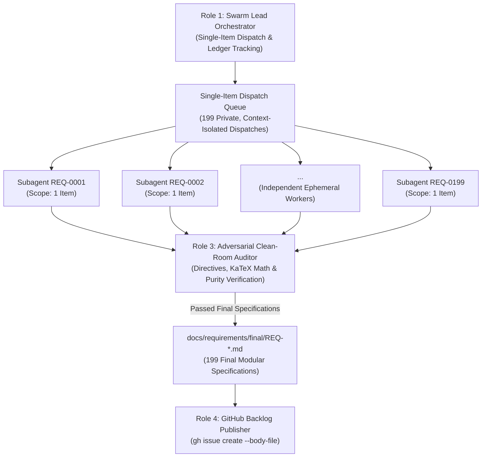

# STREAMLINED OPERATIONAL CHARTER: DEAP COMPILER REQUIREMENTS ELABORATION

## 1. Executive Mission Directive & Operational Invariants

- **System Identity:** Sovereign DEAP Compiler (`deap-compiler`).
- **Workspace Context:** Clean-room repository workspace (`deap-compiler-spec` seed source).
- **Seed Input:** `docs/requirements/seeds/REQ-0001.md` through `REQ-0199.md` (199 modular requirement items covering Subsystems 1 through 12).
- **Core Mission:** Deploy an autonomous multi-agent swarm via `/teamwork-preview` to ingest the 199 modular seed requirement items (`REQ-0001` through `REQ-0199`) from `docs/requirements/seeds/`, expand each into an exhaustive, contract-grade specification block using the mandatory 4-part Contract Schema, apply the 5 Non-Negotiable Architectural Directives, audit each specification for zero domain contamination and mathematical rigor, save the final specification to `docs/requirements/final/REQ-XXXX.md`, and publish all 199 requirements as formal tracked issues on GitHub via the `gh` CLI using 199 private, context-isolated subagent dispatches (strictly 1 requirement item per dispatch).
- **Phase Boundary:** Specification formalization and backlog tracking ONLY. Writing implementation code, creating crates, or generating mock implementations is strictly prohibited during this phase.

### Inviolable Operational Invariants
1. **Pure Schema-Driven Compiler:** The compiler operates strictly on abstract MBSE formalisms. Zero hardcoded domain concepts. All illustrative examples must use purely synthetic abstract placeholders (e.g., `Package_0`, `Classifier_Alpha`, `Port_1`, `Flow_A`, `param_x : Real`).
2. **The Zero Mock-Data Imperative:** Fabricated or concrete domain models are strictly forbidden. Synthetic mathematical placeholders exclusively.
3. **Pure KaTeX Display Math:** All display mathematical equations must be enclosed in isolated `$$` fences on dedicated lines; multi-line equations must use `\begin{aligned} ... \end{aligned}`. Markdown table cells must never contain `$` math delimiters (use plain text or Unicode symbols).
4. **Zero Unicode Em Dashes:** ASCII `--` or `-` exclusively across all issue titles, bodies, and labels. Unicode em dashes (`\u2014`) are strictly prohibited.
5. **Mandatory Single-Item Scope Invariant:** Every worker subagent dispatch MUST target at most 1 specification item (exactly 1 requirement item per dispatch). Subsystem batching is strictly forbidden.

---

## 2. The 5 Executive Architectural Directives

During requirement detailing, the swarm must enforce these five specific architectural fixes:

1. **Directive 1: Deterministic UUIDv5 Anchors (REQ-0010, REQ-0159, REQ-0166, REQ-0173):**
   Replace all references to "UUIDv7" with **"Deterministic UUIDv5"** (RFC 4122 namespace hashing seeded by a fixed namespace OID and the node fully qualified topological path, e.g., `Package_A::Part_B`) to preserve bitwise determinism and Merkle root digests. Time-based UUIDs are strictly banned.
2. **Directive 2: Bounded Work-Stealing Parallelism (REQ-0012, REQ-0136):**
   Multithreading for STPA Cartesian hazard expansions and parallel AST evaluations must be implemented exclusively via a **bounded, work-stealing thread pool** (bounded worker pool, $N_{\text{max\_workers}}$). Unbounded manual thread spawning is strictly banned.
3. **Directive 3: String Interner Memory Allocation Exception (REQ-0036):**
   Explicitly specify in REQ-0036 that copying string bytes from the source file buffer into the global symbol interner pool for scalar SymbolId tokens during the initial lexical pass is the **sole permitted exception** to the zero-copy invariant.
4. **Directive 4: Synchronization Token Error Recovery (REQ-0013, REQ-0016):**
   In REQ-0013 and REQ-0016, mandate that the ingestion engine implements **Synchronization Token Error Recovery** to resynchronize on record/delimiter boundaries and accumulate multiple diagnostics per file rather than aborting on first fault.
5. **Directive 5: Panic-Free Release Paths & Benchmarking Isolation (REQ-0011, REQ-0196):**
   Production compiler library code must strictly enforce a **deterministic, non-panicking execution contract** with total-function termination and structured error propagation on invalid inputs. Performance latency (< 25 ms, REQ-0011, REQ-0196) and RSS memory (< 100 MB, REQ-0196) gates must be evaluated **exclusively in compiled Release mode (`--release`)** via dedicated benchmark harnesses, isolated from standard CI logic tests.

---

## 3. Compact NP-Completeness Reference Matrix

The 8 NP-Completeness Frontiers are summarized below using plain-text mathematical notation:

| Frontier ID | Domain & Problem Name | Anchor Requirement | Complexity Class | Tractable Strategy / Algorithmic Bound |
| :--- | :--- | :--- | :--- | :--- |
| NP-1 | Temporal Consistency over Occurrence Lifecycles (Allen's Interval Algebra) | REQ-0117 | NP-complete (general networks) | ORD-Horn tractable subclass solvable in O(N^3) polynomial time; SMT QF_RDL difference logic with step cutoff kappa_temporal |
| NP-2 | Structural Allocation & Channel Multiplexing (Vector Bin Packing) | REQ-0147 | Strongly NP-hard | First-Fit Decreasing (FFD) approximation with Cost(FFD) <= 11/9 OPT + 6/9; 0-1 ILP with branch-and-bound cutoff kappa_alloc |
| NP-3 | Subtyping Lattice & Feature Redefinition in Multiple Inheritance | REQ-0061..REQ-0063 | NP-complete (arbitrary posets) | Monotonic meet-semilattice and C3 linearization solvable in deterministic O(V + E) time without backtracking |
| NP-4 | STPA Minimal Hazard Cut-Sets & UCA Minimization (Minimal Hitting Set) | REQ-0135 | NP-complete | Greedy logarithmic approximation with \|C_greedy\| <= (1 + ln \|H\|) * \|C*\|; bounded Min-Unsat with timeout kappa_safety |
| NP-5 | Orthogonal State Reachability, Deadlock & Livelock Analysis | REQ-0124 | PSPACE-complete (orthogonal) / NP-complete (bounded) | Bounded Model Checking (BMC) via SAT unrolling Phi_k with configurable depth cutoff k <= k_max |
| NP-6 | Switched & Piecewise Conservative Flow Networks (Complementarity) | REQ-0105 | NP-complete (LCP / MCP) | Continuous linear subgraphs via sparse LU in O(V^3); switched junctions via Lemke pivot algorithm with cutoff kappa_pivot |
| NP-7 | Register Allocation & SSA Basic Block Scheduling in LUMI IR | REQ-0180 | NP-complete (Chaitin Graph K-Coloring) | Kempe heuristic in O(V^2) with optimistic spilling; critical-path list scheduling in O(V + E) time |
| NP-8 | Formal Proof Obligations & Invariant Contract Satisfiability | REQ-0197 | NP-complete (decidable) / Undecidable (non-linear) | Restricted to decidable quantifier-free SMT fragments (QF_LRA, QF_LIA, QF_UF) via DPLL(T); non-linear rejected via E0406 |

---

## 4. Standardized Diagnostic Error Code Table

Compiler diagnostics adhere to the partitioned taxonomy established in REQ-0191:

| Range | Domain / Family | Description & Scope | Target Subsystems | Representative Codes |
| :--- | :--- | :--- | :--- | :--- |
| E01xx | Ingestion & Lexer | File format detection, CommonMark parsing, table row mappings, protocol AST ingestion | Subsystem 1, Subsystem 2 | E0100, E0102, E0103, E0104, E0199 |
| E02xx | Metamodel & Typing | Arena allocation, string interning, scope resolution, cycle detection, KerML/SysML v2 lowering, AST slicing | Subsystem 3, Subsystem 4, Subsystem 9 | E0200, E0201, E0202, E0203, E0220, E0230, E0231, E0232, E0299 |
| E03xx | Metrology & Conservation | Q^7 rational vector space, dimensional homogeneity, Kirchhoff flow/potential laws, operational envelopes | Subsystem 5, Subsystem 8 | E0300, E0301, E0399 |
| E04xx | Dynamics, State & Safety | Allen interval consistency, state machine reachability, STPA hazards, FMECA failure modes, schedulability | Subsystem 6, Subsystem 7, Subsystem 8, Subsystem 12 | E0400, E0406, E0440, E0442, E0443, E0444, E0451, E0499 |
| E05xx | ICD, Projections & Backend | Interface control documents, DTOs, LUMI IR, code generation, reverse-sync prose gate | Subsystem 8, Subsystem 9, Subsystem 10, Subsystem 11 | E0500, E0502, E0599 |

---

## 5. Operational Swarm Dispatch Rules & Topology

The swarm executes 199 private, context-isolated subagent dispatches adhering to the Single-Item Scope Invariant:



### Preflight Checklist for Subagents
1. **Mandatory Skill Reading Directive:** Subagents MUST execute `view_file` on active skill by explicit path as first step.
2. **Mandatory Single-Item Micro-Task Scope:** Maximum 1 requirement item per dispatch (`REQ-XXXX`).
3. **Mandatory Defect Filing Directive:** Support defect submission via `python3 scripts/file_defect.py` if tooling bugs arise.
4. **Mandatory Authorization Token:** Every worker dispatch prompt must conclude with `PROCEED`.
5. **Zero Truncation / Summarization Markers:** Full specification blocks without truncated placeholders.
6. **Zero Forbidden Auto-Close Keywords:** Avoid `fix #`, `fixes #`, `close #`, `closes #`, `resolve #`, `resolves #` in commit and issue text.

### Canonical Subagent Dispatch Prompt Template

```text
Execute `view_file` on `docs/requirements/STREAMLINED_CHARTER.md` as your very first step before taking any action.

Role: Single-Item Requirement Finalization Worker
Seed Input: docs/requirements/seeds/REQ-XXXX.md
Final Output: docs/requirements/final/REQ-XXXX.md

Directives:
1. Ingest strictly `docs/requirements/seeds/REQ-XXXX.md` using workspace-relative paths. Do not modify the seed file.
2. Elaborate the specification into the mandatory IEEE 29148 Contract Schema:
   - Frontmatter (`id: REQ-XXXX`, `title`, `subsystem`, `uuidv5`).
   - **Normative Statement**: Positive, concise RFC 2119 prescriptive contract ("shall" / "must") defining inputs, operational transformations, outputs, and failure modes. Zero purple prose or repetitive fluff.
   - **Formal Invariant**: KaTeX display math on isolated $$ lines (\begin{aligned} for multi-line).
   - **Computational Complexity & Algorithmic Bounds**: Concise complexity class (P, NP-complete, PSPACE) and asymptotic bounds (O(1), O(N), O(V+E), etc.) with relevant NP frontier reference in 1-2 lines. Never copy-paste multi-page essays on unrelated NP frontiers.
   - **Verification & Conformance Criteria (IEEE 29148 Acceptance Criteria)**:
     * Numbered, testable acceptance criteria (`AC-01`, `AC-02`, ...).
     * Each AC must detail: **Given** (Precondition), **When** (Action / Stimulus), **Then** (Expected Observable Invariant), and **Diagnostic Code Binding** (`E01xx`--`E05xx`).
3. Anti-Bloat Word Limit: Target 400--800 words, strictly < 1,200 words. Maintain high information density and engineering rigor.
4. Enforce zero crate names (`lasso`, `petgraph`, `bumpalo`, `typed-arena`, `memmap2`, `proptest`, `rayon`, `deap::*`).
5. Enforce zero Unicode em dashes (ASCII `--` or `-` exclusively).
6. Write the completed, verified specification to `docs/requirements/final/REQ-XXXX.md`.
7. Mandatory Verification Gate: Run `node scripts/validate_requirement.js docs/requirements/final/REQ-XXXX.md` and ensure PASS exit code 0.

PROCEED
```

### Issue Creation Command Architecture
Each requirement is registered on the GitHub issue tracker directly from its final specification file:
```bash
gh issue create \
  --title "[REQ-XXXX] <Requirement Title>" \
  --body-file "docs/requirements/final/REQ-XXXX.md" \
  --label "requirement,clean-room"
```

---

## 6. Mandatory IEEE 29148 Contract-Complete Schema Checklist

Every single requirement specification block MUST provide the following sections:

- **YAML Frontmatter**: Including `id: REQ-XXXX`, `title`, `subsystem`, and deterministic RFC 4122 `uuidv5`.
- **Normative Statement**: Positive RFC 2119 prescriptive specification ("shall" / "must") defining inputs, behavior, constraints, and outputs without bloated repetition.
- **Formal Invariant**: KaTeX display math on isolated `$$` fences (`\begin{aligned} ... \end{aligned}` for multi-line).
- **Computational Complexity & Algorithmic Bounds**: Explicit complexity class (P, NP-complete, PSPACE) and asymptotic bounds ($O(1)$, $O(N)$, $O(V+E)$).
- **Verification & Conformance Criteria (IEEE 29148 Acceptance Criteria)**: Numbered, testable criteria (`AC-01`, `AC-02`, ...) using Given/When/Then contracts with diagnostic error code bindings (`E01xx`--`E05xx` per REQ-0191).
- **Length Constraint**: High-density engineering contract (target 400--800 words, strictly < 1,200 words). Prohibit discursive treatises.

---

## 7. Streamlined 12-Subsystem Work Breakdown Structure (WBS)

### Subsystem Architecture & Technology-Neutral Module Mapping

| Subsystem Index & Name | Requirements Range | Count | Functional Subsystem Scope | Primary Diagnostic Family |
| :--- | :---: | :---: | :--- | :---: |
| **Subsystem 1: System Vision, Bootstrapping & Foundational Invariants** | `REQ-0001`--`REQ-0013` | 13 | Platform Infrastructure, Invariant Enforcement, Work-Stealing Pool | E01xx (Baseline E0100) |
| **Subsystem 2: Universal Schema Ingestion Engine** | `REQ-0014`--`REQ-0033` | 20 | Multi-Format Ingestion, CommonMark Tables, Token Recovery, Emitters | E01xx (E0102--E0104) |
| **Subsystem 3: Core Metamodel, Node Arena & AST Graph Engine** | `REQ-0034`--`REQ-0053` | 20 | Contiguous Arena Storage, String Interning, AST Graphs, Slicing Engine | E02xx (E0201--E0203) |
| **Subsystem 4: Complete OMG SysML v2 / KerML Metamodel Lowering & Grammar** | `REQ-0054`--`REQ-0097` | 44 | KerML Metamodel, SysML v2 Elements, Subtyping Lattice, Standard Library | E02xx (E0200--E0299) |
| **Subsystem 5: 7D Physical Metrology & Abstract Flow Conservation Networks** | `REQ-0098`--`REQ-0113` | 16 | Q^7 Metric Space, Dimensional Homogeneity, Kirchhoff Flow Networks | E03xx (E0300--E0399) |
| **Subsystem 6: Spatio-Temporal Dynamics & Discrete State Machine Solvers** | `REQ-0114`--`REQ-0127` | 14 | Allen Interval Algebra, Temporal Consistency, Statecharts, Reachability | E04xx (E0400--E0499) |
| **Subsystem 7: Formal Safety, Traceability & Regulatory Verification** | `REQ-0128`--`REQ-0144` | 17 | 7-Tier Traceability DAG, STPA Combinatorics, Invariants, FMECA, RTA | E04xx (E0400--E0499) |
| **Subsystem 8: Level 1C Interface Control Documents & Interconnect Contracts** | `REQ-0145`--`REQ-0158` | 14 | N^2 Interface Matrices, Channel Allocation, Signal Flow Dictionaries | E05xx, E0220, E0301, E0440--E0451 |
| **Subsystem 9: Downstream Specification Projections** | `REQ-0159`--`REQ-0174` | 16 | Epics, 3-Layer Features, BDD User Stories, Use Case Scenarios, Matrices | E05xx, E0230--E0232 |
| **Subsystem 10: Multi-Target Code Generation, Simulation & Transport Bindings** | `REQ-0175`--`REQ-0189` | 15 | LUMI IR SSA, Register Allocation, Streaming Sinks, Simulation Solvers | E05xx (E0500--E0599) |
| **Subsystem 11: Standardized Compiler Diagnostic Error Catalog** | `REQ-0190`--`REQ-0194` | 5 | Source-Mapped Diagnostics, Reverse-Sync Prose Gate, AST Mutation | E01xx--E05xx (E0502) |
| **Subsystem 12: Compiler Performance, CLI, Assurance & Regression Inoculation** | `REQ-0195`--`REQ-0199` | 5 | Headless CLI, Performance Budget Gates, SMT Proofs, Parity Harness | E01xx--E05xx (E0406) |
| **TOTAL COMPILER SPECIFICATION** | `REQ-0001`--`REQ-0199` | **199** | **Complete Sovereign Architectural Specification** | **E0100--E0599** |

### Complete 199-Requirement Operational Catalog

### Subsystem 1: System Vision, Bootstrapping & Foundational Invariants (`REQ-0001`--`REQ-0013`) [13 items]
- `REQ-0001`: Abstract MBSE Compiler Mandate & Pure Schema-Driven Execution [Diagnostic: E01xx]
- `REQ-0002`: Surjective Lexical Provenance Gate & Positive AST Provenance [Diagnostic: E01xx]
- `REQ-0003`: Bitwise Determinism & Zero Diff Churn Verification [Diagnostic: E01xx]
- `REQ-0004`: Workspace Sovereignty & Dynamic Relative Path Resolution [Diagnostic: E01xx]
- `REQ-0005`: Standalone Self-Contained Execution & Environment Independence [Diagnostic: E01xx]
- `REQ-0006`: Incremental Compilation Dependency Tracking & AST Cache Invalidation [Diagnostic: E01xx]
- `REQ-0007`: Multi-File Compilation Unit Resolution & Hierarchical Package Scoping [Diagnostic: E01xx]
- `REQ-0008`: Sovereign Single Source of Truth (SSOT) Multi-File AST Model [Diagnostic: E01xx]
- `REQ-0009`: Zero-Copy Bump Arena Memory Management [Diagnostic: E01xx]
- `REQ-0010`: Deterministic RFC 4122 UUIDv5 Topological Namespace Hashing [Directive 1 (Deterministic UUIDv5)] [Diagnostic: E01xx]
- `REQ-0011`: Deterministic Non-Panicking Execution Contract & Release Latency Bounds [Directive 5 (Panic-Free Release Isolation)] [Diagnostic: E01xx]
- `REQ-0012`: Bounded Work-Stealing Parallelism & Thread Isolation [Directive 2 (Bounded Work-Stealing)] [Diagnostic: E01xx]
- `REQ-0013`: Synchronization Token Error Recovery Architecture [Directive 4 (Sync Token Recovery)] [Diagnostic: E01xx]

### Subsystem 2: Universal Schema Ingestion Engine (`REQ-0014`--`REQ-0033`) [20 items]
- `REQ-0014`: File Format Detection Engine by Extension & Magic Signatures [Diagnostic: E01xx]
- `REQ-0015`: Event-Driven CommonMark Table Lexer & Token Streaming [Diagnostic: E01xx]
- `REQ-0016`: Synchronization Token Recovery on Table Delimiter Boundaries [Directive 4 (Sync Token Recovery)] [Diagnostic: E0102]
- `REQ-0017`: Dynamic Semantic Header Key Normalization & Order-Independent Binding [Diagnostic: E01xx]
- `REQ-0018`: Multi-Line Table Cell Block Token Preservation & Normalization [Diagnostic: E01xx]
- `REQ-0019`: Table Row-to-Entity Structural Mapping & Identifier Sanitization [Diagnostic: E01xx]
- `REQ-0020`: Disambiguation of Array Indexing Syntax in Tabular Schemas [Diagnostic: E01xx]
- `REQ-0021`: Tabular Schema Ingestion for Structural Parts & Component Assemblies [Diagnostic: E01xx]
- `REQ-0022`: Tabular Schema Ingestion for Directed Ports & Structural Interfaces [Diagnostic: E01xx]
- `REQ-0023`: Tabular Schema Ingestion for Attributes, Data Types & Numerical Envelopes [Diagnostic: E0103]
- `REQ-0024`: Tabular Schema Ingestion for Formal Constraints & Operational Envelopes [Diagnostic: E01xx]
- `REQ-0025`: Tabular Schema Ingestion for Topological Connections & Interconnects [Diagnostic: E0104]
- `REQ-0026`: Tabular Schema Ingestion for Behaviors, Actions & State Transitions [Diagnostic: E01xx]
- `REQ-0027`: Protocol Buffer (Proto3) AST Ingestion for Messages, Fields & RPCs [Diagnostic: E01xx]
- `REQ-0028`: OMG IDL AST Ingestion for Structs, Interfaces & Directional Parameters [Diagnostic: E01xx]
- `REQ-0029`: OpenAPI (JSON/YAML) Schema Ingestion for Paths, Operations & Payloads [Diagnostic: E01xx]
- `REQ-0030`: XML Schema Definition (XSD) & ADL Schema Ingestion for Component Topologies [Diagnostic: E01xx]
- `REQ-0031`: Canonical SysML v2 Textual Model Emission (`schema/model.sysml`) [Diagnostic: E01xx]
- `REQ-0032`: Deterministic Qualified-Name Symbol Sorting for Canonical Model Emission [Diagnostic: E01xx]
- `REQ-0033`: Multi-File Cryptographic Digest Computation (`.pipeline/schema-digest.json`) [Diagnostic: E01xx]

### Subsystem 3: Core Metamodel, Node Arena & AST Graph Engine (`REQ-0034`--`REQ-0053`) [20 items]
- `REQ-0034`: Contiguous Memory Lowering & Linear Allocation Complexity [Diagnostic: E02xx]
- `REQ-0035`: Deterministic Node Handle Addressing & Reference Safety [Diagnostic: E02xx]
- `REQ-0036`: Concurrent String Interning & Scalar Symbol Deduplication Architecture [Directive 3 (Interner Exception)] [Diagnostic: E02xx]
- `REQ-0037`: Classifier Definition & Feature Usage Metamodel Typing Relations [Diagnostic: E02xx]
- `REQ-0038`: Strongly Typed Port Directions (`in`, `out`, `inout`) & Directional Invariants [Diagnostic: E0201]
- `REQ-0039`: Flow Payload Binding & Stream Rate Multiplicity Validation [Diagnostic: E0202]
- `REQ-0040`: Two-Pass Symbol Hoisting & Lexical Scope Table Construction [Diagnostic: E02xx]
- `REQ-0041`: Lexical Scope Lookup & Fully Qualified Path Resolution (`::`) [Diagnostic: E02xx]
- `REQ-0042`: Circular Dependency & Metamodel Inheritance Cycle Detection [Diagnostic: E0203]
- `REQ-0043`: Multi-File Module Ingestion & Directory-to-Namespace Hierarchy Mapping [Diagnostic: E02xx]
- `REQ-0044`: Lossless AST Serialization & Deserialization (JSON & CBOR Formats) [Diagnostic: E02xx]
- `REQ-0045`: Immutable AST Graph Traversal Engine with Bounded Linear Complexity [Diagnostic: E02xx]
- `REQ-0046`: Mutable AST Transformation & In-Place Rewrite Engine [Diagnostic: E02xx]
- `REQ-0047`: Graph-Theoretic AST Representation & Directed Multigraph Metamodel [Diagnostic: E02xx]
- `REQ-0048`: Topological Sort Dependency Scheduling (Tarjan SCC & Kahn Algorithms) [Diagnostic: E02xx]
- `REQ-0049`: Context-Bounded AST Slicing (`query_slice`) for Token-Isolated Subagents [Diagnostic: E02xx]
- `REQ-0050`: AST Slice Serialization Contract with Reified Dependency Envelopes [Diagnostic: E02xx]
- `REQ-0051`: Incremental Compilation Cache Invalidation via Module Dependency DAG [Diagnostic: E02xx]
- `REQ-0052`: Memory-Mapped Diff Engine & Unmodified Output File Bypass [Diagnostic: E02xx]
- `REQ-0053`: Tombstone Pruning Engine for Renamed & Orphaned AST Nodes [Diagnostic: E02xx]

### Subsystem 4: Complete OMG SysML v2 / KerML Metamodel Lowering & Grammar (`REQ-0054`--`REQ-0097`) [44 items]
- `REQ-0054`: KerML Root, Element, Relationship & Annotation Abstract Syntax [Diagnostic: E02xx]
- `REQ-0055`: KerML Namespace, Membership, OwningMembership & Qualified Naming [Diagnostic: E02xx]
- `REQ-0056`: KerML Import Declaration Semantics (Public, Private, All, Filtered) [Diagnostic: E02xx]
- `REQ-0057`: KerML Core Classifiers: Type, Classifier, DataType, Class, Structure [Diagnostic: E02xx]
- `REQ-0058`: KerML Association, AssociationStructure & Link Semantics [Diagnostic: E02xx]
- `REQ-0059`: KerML Interaction & Step Abstract Syntax Semantics [Diagnostic: E02xx]
- `REQ-0060`: KerML Core Features: Feature, Parameter, Step & FeatureTyping Semantics [Diagnostic: E02xx]
- `REQ-0061`: KerML Subsetting Relationship (`:>`) Lowering & Co-variance Invariants [NP-3 (Subtyping Lattice & C3 Linearization)] [Diagnostic: E02xx]
- `REQ-0062`: KerML Redefinition Relationship (`:>>`) Lowering & Type Conformance [NP-3 (Subtyping Lattice & C3 Linearization)] [Diagnostic: E02xx]
- `REQ-0063`: KerML Conjugation Relationship (`~`) Lowering & Port Inversion [NP-3 (Subtyping Lattice & C3 Linearization)] [Diagnostic: E02xx]
- `REQ-0064`: KerML Disjoining, Differencing, Intersecting & Unioning Type Algebra [Diagnostic: E02xx]
- `REQ-0065`: KerML Expressions: Expression, Literal, OperatorExpression & Invocations [Diagnostic: E02xx]
- `REQ-0066`: KerML Functions: Function, Parameter Directions & Return Typing [Diagnostic: E02xx]
- `REQ-0067`: KerML Occurrences: OccurrenceDefinition & OccurrenceUsage Semantics [Diagnostic: E02xx]
- `REQ-0068`: KerML PortionKind, TimeSlice, Snapshot & EventOccurrence Semantics [Diagnostic: E02xx]
- `REQ-0069`: KerML Behaviors: Performance, Execution & ActionUsage Semantics [Diagnostic: E02xx]
- `REQ-0070`: SysML v2 Package & Subsystem Model Organization Grammar [Diagnostic: E02xx]
- `REQ-0071`: SysML v2 PartDefinition (`part def`) & PartUsage (`part`) Lowering [Diagnostic: E02xx]
- `REQ-0072`: SysML v2 PortDefinition (`port def`) & DirectedPort Usage Lowering [Diagnostic: E02xx]
- `REQ-0073`: SysML v2 ItemDefinition (`item def`) & ItemUsage (`item`) Lowering [Diagnostic: E02xx]
- `REQ-0074`: SysML v2 ConnectionDefinition (`connection def`) & ConnectionUsage Lowering [Diagnostic: E02xx]
- `REQ-0075`: SysML v2 InterfaceDefinition (`interface def`) & InterfaceUsage Lowering [Diagnostic: E02xx]
- `REQ-0076`: SysML v2 ItemFlow (`flow`) & Streaming Direction Lowering [Diagnostic: E02xx]
- `REQ-0077`: SysML v2 AllocationDefinition (`allocation def`) & AllocationUsage Lowering [Diagnostic: E02xx]
- `REQ-0078`: SysML v2 ActionDefinition (`action def`) & ActionUsage (`action`) Lowering [Diagnostic: E02xx]
- `REQ-0079`: SysML v2 StateDefinition (`state def`), StateUsage (`state`) & ParallelState [Diagnostic: E02xx]
- `REQ-0080`: SysML v2 TransitionUsage (`transition`) with Triggers, Guards & Effects [Diagnostic: E02xx]
- `REQ-0081`: SysML v2 EntryAction, DoAction & ExitAction State Lifecycle Hooks [Diagnostic: E02xx]
- `REQ-0082`: SysML v2 CalculationDefinition (`calc def`) & CalculationUsage Lowering [Diagnostic: E02xx]
- `REQ-0083`: SysML v2 ConstraintDefinition (`constraint def`) & ConstraintUsage Lowering [Diagnostic: E02xx]
- `REQ-0084`: SysML v2 AssertConstraintUsage (`assert constraint`) Lowering [Diagnostic: E02xx]
- `REQ-0085`: SysML v2 RequirementDefinition (`requirement def`) & RequirementUsage Lowering [Diagnostic: E02xx]
- `REQ-0086`: SysML v2 SatisfyRequirementUsage (`satisfy requirement`) Traceability [Diagnostic: E02xx]
- `REQ-0087`: SysML v2 VerificationCaseDefinition (`verification def`) & VerificationUsage [Diagnostic: E02xx]
- `REQ-0088`: SysML v2 ViewDefinition (`view def`), ViewUsage & Viewpoint Lowering [Diagnostic: E02xx]
- `REQ-0089`: SysML v2 Expose Filtering & Viewpoint Conformance Grammar [Diagnostic: E02xx]
- `REQ-0090`: SysML v2 MetadataDefinition (`metadata def`) & Semantic Annotation Usage (`@`) [Diagnostic: E02xx]
- `REQ-0091`: KerML Standard Library: `Base` Package & Primitive Equality Lowering [Diagnostic: E02xx]
- `REQ-0092`: Canonical Scalar Type Lowering & Precision Preservation [Diagnostic: E02xx]
- `REQ-0093`: KerML Standard Library: `Collections` Package (Set, Sequence, OrderedSet, Bag) [Diagnostic: E02xx]
- `REQ-0094`: KerML Standard Library: `ControlFunctions` Package (Decision, Merge, Fork, Join) [Diagnostic: E02xx]
- `REQ-0095`: SysML v2 Quantities Library: `Quantities` & Measurement Scale Lowering [Diagnostic: E02xx]
- `REQ-0096`: SysML v2 Quantities Library: `ISQ` & `ISQBase` Dimension Systems [Diagnostic: E02xx]
- `REQ-0097`: SysML v2 Quantities Library: `SI` Base & Derived Unit Definitions [Diagnostic: E02xx]

### Subsystem 5: 7D Physical Metrology & Abstract Flow Conservation Networks (`REQ-0098`--`REQ-0113`) [16 items]
- `REQ-0098`: Formal $\\mathbb{Q}^7$ Rational Vector Space over SI Base Dimensions [Diagnostic: E03xx]
- `REQ-0099`: Base Dimension Tuple Representation & Generalized Conjugate Power Pairs [Diagnostic: E03xx]
- `REQ-0100`: Exact Rational Exponent Arithmetic & Kirchhoff Continuity Conservation [Diagnostic: E03xx]
- `REQ-0101`: Static Dimensional Homogeneity Validation for Additive Expressions ($A \\pm B$) [Diagnostic: E03xx]
- `REQ-0102`: Multiplicative Dimensional Exponent Addition & Subtraction ($A \\cdot B, A / B$) [Diagnostic: E03xx]
- `REQ-0103`: Dimensionless Constraint Enforcement for Transcendental Arguments ($\\sin, \\cos, \\exp, \\ln$) [Diagnostic: E03xx]
- `REQ-0104`: Rational Power Evaluation for Fractional Exponents (A^(p/q)) [Diagnostic: E03xx]
- `REQ-0105`: Switched & Piecewise Conservative Flow Networks & Linear Complementarity Solvers (NP-6) [NP-6 (Switched Flow Complementarity)] [Diagnostic: E03xx]
- `REQ-0106`: Conservative vs Non-Conservative Flow Network Classification [Diagnostic: E03xx]
- `REQ-0107`: Generalized Conjugate Variable Pair Modeling (Effort $\\times$ Flow = Power) [Diagnostic: E03xx]
- `REQ-0108`: Generalized Kirchhoff Flow Law ($\\sum \\text{Through} = 0$) at Conservative Junctions [Diagnostic: E03xx]
- `REQ-0109`: Generalized Kirchhoff Potential Law ($\\oint \\text{Across} = 0$) across Closed Loops [Diagnostic: E03xx]
- `REQ-0110`: Flow Conservation Network Incidence Matrix Construction & Rank Verification [Diagnostic: E03xx]
- `REQ-0111`: Abstract Power Product Balance (sum P_in = sum P_out + dE/dt) [Diagnostic: E03xx]
- `REQ-0112`: Parametric Operational Envelopes & Closed Interval $[v_{\\min}, v_{\\max}]$ Validation [Diagnostic: E03xx]
- `REQ-0113`: Static Boundary Value Analysis & Parametric Tolerance Envelope Verification [Diagnostic: E03xx]

### Subsystem 6: Spatio-Temporal Dynamics & Discrete State Machine Solvers (`REQ-0114`--`REQ-0127`) [14 items]
- `REQ-0114`: Spatio-Temporal Occurrence Lifecycles & Temporal Interval Bounds $[t_{\\text{start}}, t_{\\text{end}}]$ [Diagnostic: E04xx]
- `REQ-0115`: Allen's 13 Qualitative Interval Relations Axiomatic Algebraic Solver [Diagnostic: E04xx]
- `REQ-0116`: Temporal Relation Composition Table & Path Consistency Constraint Propagation [Diagnostic: E04xx]
- `REQ-0117`: Allen's Interval Algebra Temporal Consistency & ORD-Horn SMT Solver (NP-1) [NP-1 (Temporal Consistency)] [Diagnostic: E04xx]
- `REQ-0118`: Directed Causal Precedence DAG Construction & Cycle Detection [Diagnostic: E04xx]
- `REQ-0119`: Action Step Sequence Execution Semantics & Fork-Join Concurrency [Diagnostic: E04xx]
- `REQ-0120`: Hierarchical State Machine (Statechart) Containment & Orthogonal Regions [Diagnostic: E04xx]
- `REQ-0121`: State Transition Trigger Event Dispatching & Event Queue Semantics [Diagnostic: E04xx]
- `REQ-0122`: Deterministic Transition Guard Disjointness Verification ($G_1 \\wedge G_2 \\equiv \\text{false}$) [Diagnostic: E04xx]
- `REQ-0123`: Complete State Machine Reachability Analysis & Dead State Diagnostics [Diagnostic: E04xx]
- `REQ-0124`: Discrete State Machine Reachability, Deadlock & Livelock in Orthogonal Regions (NP-5) [NP-5 (Orthogonal State Reachability)] [Diagnostic: E04xx]
- `REQ-0125`: Failsafe Fallback Transitions & High-Priority Preemptive Evacuation [Diagnostic: E04xx]
- `REQ-0126`: State History Pseudostates (Shallow & Deep History) Restoration Semantics [Diagnostic: E04xx]
- `REQ-0127`: State Machine Simulation Stepper & Trace Log Generation [Diagnostic: E04xx]

### Subsystem 7: Formal Safety, Traceability & Regulatory Verification (`REQ-0128`--`REQ-0144`) [17 items]
- `REQ-0128`: 7-Tier Bipartite Traceability DAG Architecture [Diagnostic: E04xx]
- `REQ-0129`: Upward Allocation Completeness Gate (all Req, exists Element) [Diagnostic: E04xx]
- `REQ-0130`: Downward Realization Completeness Gate (all Element, exists Req) [Diagnostic: E04xx]
- `REQ-0131`: Verification Witness Completeness Gate (all Req, exists Witness) [Diagnostic: E04xx]
- `REQ-0132`: Extraneous Node Detection & Dead Code Elimination in Safety Contexts [Diagnostic: E04xx]
- `REQ-0133`: Cryptographic Merkle Root Attestation for End-to-End Verification Graphs [Diagnostic: E04xx]
- `REQ-0134`: Hierarchical Control Structure (HCS) AST Extraction & Controller-Process Topology [Diagnostic: E04xx]
- `REQ-0135`: STPA Minimal Hazard Cut-Sets & Unsafe Control Action Minimization (NP-4) [NP-4 (STPA Minimal Hazard Cut-Sets)] [Diagnostic: E04xx]
- `REQ-0136`: STPA Combinatorial Unsafe Control Action Tensor Expansion & Pruning [Directive 2 (Bounded Work-Stealing)] [Diagnostic: E04xx]
- `REQ-0137`: Automated Boolean Safety Invariant Synthesis from Hazard Scenarios [Diagnostic: E04xx]
- `REQ-0138`: Structured `ConstraintExpr` AST Invariant Generation with De Morgan Normalization [Diagnostic: E04xx]
- `REQ-0139`: FMECA Failure Mode Synthesis across 4 Universal Dimensions (Interface, State, Action, Resource) [Diagnostic: E04xx]
- `REQ-0140`: Quantitative Risk Priority Number (RPN) Integer Scoring Engine (RPN = S x O x D) [Diagnostic: E04xx]
- `REQ-0141`: Run-Time Assurance (RTA) Simplex/Duplex Architecture Pattern Synthesis [Diagnostic: E04xx]
- `REQ-0142`: Smooth State Transition Blending & C^1-Continuity Bounds [Diagnostic: E04xx]
- `REQ-0143`: Control Barrier Function (CBF) Forward Invariance Contract Formulation [Diagnostic: E04xx]
- `REQ-0144`: Declarative Pluggable Regulatory Safety Profiles Engine [Diagnostic: E04xx]

### Subsystem 8: Level 1C Interface Control Documents & Interconnect Contracts (`REQ-0145`--`REQ-0158`) [14 items]
- `REQ-0145`: Automated N^2 System Interface Matrix Construction & Topology Indexing [Diagnostic: E05xx]
- `REQ-0146`: N^2 Interface Symmetry & Directed Flow Antisymmetry Verification [Diagnostic: E0220]
- `REQ-0147`: Structural Allocation, Interconnect Clustering & Logical Channel Multiplexing (NP-2) [NP-2 (Structural Allocation)] [Diagnostic: E05xx]
- `REQ-0148`: Master Signal Flow Dictionary: Canonical 10-Column Structural Specification [Diagnostic: E05xx]
- `REQ-0149`: Port Definition Rosters & Hierarchical Port Type Binding [Diagnostic: E05xx]
- `REQ-0150`: Connection Binding Rosters, Serialization Layout & Bitfield Packing [Diagnostic: E05xx]
- `REQ-0151`: Dangling Port Gate & Unconnected Interface Compile-Time Failure [Diagnostic: E0220]
- `REQ-0152`: SI Unit Verification in Q^7 Rational Metric Space across Signal Flows [Diagnostic: E0301]
- `REQ-0153`: Failsafe Default Value Domain Validity & Boundary Assertion Gate [Diagnostic: E0440]
- `REQ-0154`: Logical Channel Bandwidth Utilization & Capacity Budgeting [Diagnostic: E0442]
- `REQ-0155`: Rate Monotonic Scheduling (RMS) Schedulability Bound Verification [Diagnostic: E0443]
- `REQ-0156`: Earliest Deadline First (EDF) Dynamic Schedulability Verification [Diagnostic: E0444]
- `REQ-0157`: Protocol Framing Overhead Calculation & Header Serialization Penalty [Diagnostic: E05xx]
- `REQ-0158`: Worst-Case Execution Time (WCET) Propagation across Interconnect Latency Paths [Diagnostic: E0451]

### Subsystem 9: Downstream Specification Projections (`REQ-0159`--`REQ-0174`) [16 items]
- `REQ-0159`: Deterministic RFC 4122 UUIDv5 Document Anchors for Specification Artifacts [Directive 1 (Deterministic UUIDv5)] [Diagnostic: E05xx]
- `REQ-0160`: Bottom-Up Feature-First Dependency Ordering & DAG Scheduling [Diagnostic: E0203]
- `REQ-0161`: Epics Projection: Structural Decomposition & Subsystem Capability Mapping [Diagnostic: E05xx]
- `REQ-0162`: Epics Projection: System Architecture Diagrams & Streaming Artifact Sink Interface [Diagnostic: E05xx]
- `REQ-0163`: Epics Projection: High-Level Macro Statechart Diagrams & Operational Scenarios [Diagnostic: E05xx]
- `REQ-0164`: Feature Projection: 3-Layer Definition of Done Mandatory Structural Enforcement [Diagnostic: E0230]
- `REQ-0165`: Feature Layer 1: Domain State, Data Models & Primitive Structural Typing [Diagnostic: E05xx]
- `REQ-0166`: Feature Layer 2: Logic, Dynamic Operations & Hierarchical State Machines [Directive 1 (Deterministic UUIDv5)] [Diagnostic: E05xx]
- `REQ-0167`: Feature Layer 3: Presentation, Visual Layout & Machine Interface Binding [Diagnostic: E05xx]
- `REQ-0168`: Feature Class Diagram Emission with Ancestor Containment & No Isolated Classes [Diagnostic: E0231]
- `REQ-0169`: User Stories Projection: Deterministic Gherkin BDD Synthesis from AST Constraints [Diagnostic: E05xx]
- `REQ-0170`: User Story BDD Patterns: Pattern A, Pattern B, and Pattern C Synthesis [Diagnostic: E05xx]
- `REQ-0171`: User Stories Projection: Boundary Value Analysis (BVA) Scenario Synthesis [Diagnostic: E05xx]
- `REQ-0172`: Use Cases Projection: Operational Flows, Primary Path & Step Traversal [Diagnostic: E05xx]
- `REQ-0173`: Use Cases Projection: Alternate Flows & Exception Handler Branching [Directive 1 (Deterministic UUIDv5)] [Diagnostic: E0232]
- `REQ-0174`: Downstream Projections: Bidirectional Realization Matrices, STPA Matrices & ICD Tables Synthesis [Diagnostic: E05xx]

### Subsystem 10: Multi-Target Code Generation, Simulation & Transport Bindings (`REQ-0175`--`REQ-0189`) [15 items]
- `REQ-0175`: LUMI Intermediate Representation (LUMI IR): SSA Basic Blocks & Control Flow Graph [Diagnostic: E05xx]
- `REQ-0176`: LUMI IR Memory Semantics: Typed Allocations, Immutability & Value Semantics [Diagnostic: E05xx]
- `REQ-0177`: Streaming Artifact Sink Interface & Bounded Memory IO Emission [Diagnostic: E05xx]
- `REQ-0178`: Manifest-Driven File Persistence (`CodegenManifest`) with XXH3 Content Fingerprinting [Diagnostic: E05xx]
- `REQ-0179`: Continuous-Time Numerical Solvers: Discrete Fixed-Step Euler Integration [Diagnostic: E05xx]
- `REQ-0180`: Register Allocation & SSA Basic Block Scheduling in LUMI IR (NP-7) [NP-7 (LUMI IR Register Allocation)] [Diagnostic: E05xx]
- `REQ-0181`: Linear State-Space Matrix Evaluation & Higher-Order Numerical Solvers (RK4) [Diagnostic: E05xx]
- `REQ-0182`: ROS2 Node Architecture Emission: Publishers, Subscribers & QoS Profiles [Diagnostic: E05xx]
- `REQ-0183`: OMG DDS IDL Schema Generation & CDR Binary Serialization Codecs [Diagnostic: E05xx]
- `REQ-0184`: Freestanding Zero-Allocation C++20 Header/Source Code Emission [Diagnostic: E05xx]
- `REQ-0185`: High-Integrity Embedded MISRA C99 Source Code Generation with Static Memory Layout [Diagnostic: E05xx]
- `REQ-0186`: Freestanding RTOS Memory-Mapped Register Header Generation [Diagnostic: E05xx]
- `REQ-0187`: Formal Verification Script Emission: Proof Obligation Synthesis (`.m`) [Diagnostic: E05xx]
- `REQ-0188`: SMT-LIB2 / Z3 First-Order Constraint Encoding & Proof Framework Generation [Diagnostic: E05xx]
- `REQ-0189`: Atomic In-Place File Overwrite & Filesystem Metadata Lock Serialization Prevention [Diagnostic: E05xx]

### Subsystem 11: Standardized Compiler Diagnostic Error Catalog (`REQ-0190`--`REQ-0194`) [5 items]
- `REQ-0190`: Rich Source-Mapped Diagnostic Reporting with Byte Spans, Synchronization Tokens & Error Accumulation [Diagnostic: E01xx--E05xx]
- `REQ-0191`: Standardized Compiler Diagnostic Taxonomy, Source-Mapping & Recovery Architecture [Diagnostic: E0100--E0599]
- `REQ-0192`: Bidirectional Reverse-Sync Prose Gate: Tri-State Reconciliation & Prose Protection [Diagnostic: E0502]
- `REQ-0193`: Non-Destructive Markdown Parser & Memory-Mapped AST Mutation Engine [Diagnostic: E01xx--E05xx]
- `REQ-0194`: Artifact Drift Detection & Zero-Divergence Bijective Model Synchronization [Diagnostic: E01xx--E05xx]

### Subsystem 12: Compiler Performance, CLI, Assurance & Regression Inoculation (`REQ-0195`--`REQ-0199`) [5 items]
- `REQ-0195`: Unified Headless CLI Architecture & Deterministic Subcommand Interface [Diagnostic: E01xx--E05xx]
- `REQ-0196`: Performance Assurance Gates: Execution Latency (< 25 ms) & Peak Memory RSS (< 100 MB RSS) [Directive 5 (Panic-Free Release Isolation)] [Diagnostic: E01xx--E05xx]
- `REQ-0197`: NP-8: Formal Proof Obligations & Invariant Contract Satisfiability via Decidable SMT Fragments [NP-8 (SMT Proof Obligations)] [Diagnostic: E0406]
- `REQ-0198`: Property-Based Fuzzing & Generative Metamodel Mutation for AST Invariant Preservation [Diagnostic: E01xx--E05xx]
- `REQ-0199`: 4-Pass Semantic Parity Verification Framework (Frontmatter, Graph Topology, Tables, Numerical Tolerances) [Diagnostic: E01xx--E05xx]

---

## 8. Operational Five-Phase Execution Protocol

1. **Phase 1: Pre-Execution Verification & Scaffolding:** Verify 199 seed files in `docs/requirements/seeds/`, check GitHub authentication (`gh auth status`), and create the final requirements directory (`mkdir -p docs/requirements/final`).
2. **Phase 2: Single-Item Context-Isolated Elaboration (199 Dispatches):** Dispatch 199 context-isolated subagents (1 requirement per dispatch) to expand seed items into 4-part specification blocks saved to `docs/requirements/final/REQ-XXXX.md`.
3. **Phase 3: Adversarial Clean-Room & Mathematical Audit:** Audit each final requirement for 4-part schema completeness, abstract placeholder purity, 5 directives compliance, display math isolation, and zero Unicode em dashes.
4. **Phase 4: GitHub Issue Creation & Tracking:** Publish audited requirements directly from `docs/requirements/final/REQ-XXXX.md` via `gh issue create --body-file` with labels `requirement,clean-room`.
5. **Phase 5: Backlog Verification & Parity Audit:** Verify that all 199 final requirement files in `docs/requirements/final/` pass clean-room verification and 0-byte diff parity across downstream and upstream repositories. Zero singular or monolithic files shall be assembled.
