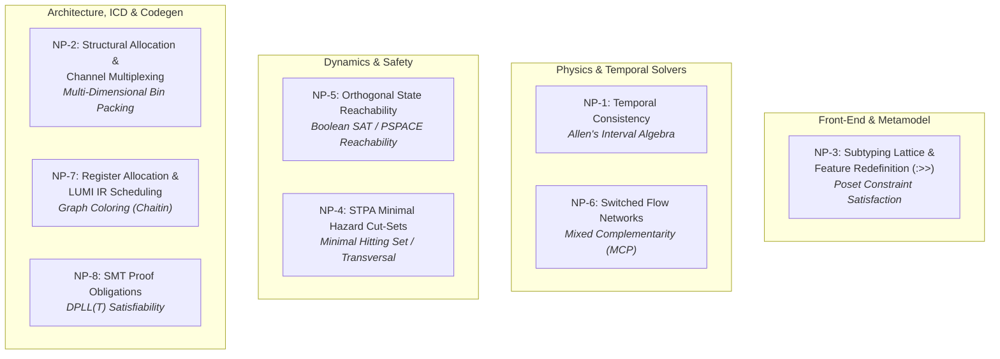
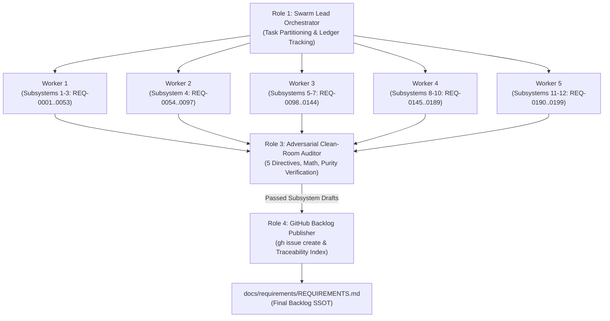

# TEAMWORK SWARM CHARTER: DEAP COMPILER REQUIREMENTS ELABORATION & BACKLOG PUBLICATION

## 1. Prime Mission Directive & System Context

- **System Identity:** Sovereign DEAP Compiler (`deap-compiler`).
- **Workspace Context:** Clean-room repository workspace (`deap-compiler-spec` seed source).
- **Seed Input:** `docs/requirements/REQUIREMENTS_SKELETON.md` and modular skeleton item catalog in `docs/requirements/items/` (199 modular skeleton items covering Subsystems 1 through 12, `REQ-0001` through `REQ-0199`).
- **Core Mission:** Deploy an autonomous multi-agent swarm via `/teamwork-preview` to ingest the 199 modular skeleton items (`REQ-0001` through `REQ-0199`), expand each into an exhaustive, contract-grade IEEE 29148 specification block using the mandatory 4-part Detailing Template, apply the 5 Non-Negotiable Architectural Directives, audit each draft for zero domain contamination and mathematical rigor, and publish all 199 requirements as formal tracked issues on GitHub via the `gh` CLI.
- **Phase Boundary:** Specification formalization and backlog tracking ONLY. Writing implementation code, creating crates, or generating mock implementations is strictly prohibited during this phase.

---

## 2. Inviolable Clean-Room Invariants

Every agent in the swarm MUST strictly enforce these four zero-compromise rules:

1. **Pure Schema-Driven Compiler (Zero Hardcoded Domain Concepts):**
   The compiler is an abstract Model-Based Systems Engineering (MBSE) compiler and formal verification engine. It operates exclusively on generic systems engineering primitives: Classifiers, Ports, Connectors, Rational Dimensional Exponents, Kirchhoff Flow Networks, and Temporal Intervals. All entities, signals, physical bounds, and units derive deterministically from user-supplied schemas. Every example, scenario, or parameter must use purely synthetic abstract placeholders (e.g., `Package_0`, `Classifier_Alpha`, `Port_1`, `Flow_A`, `param_x : Real`).
2. **The Zero Mock-Data Imperative:**
   Under no circumstances shall any elaborated requirement contain hypothetical or fabricated concrete domain models. All illustrative examples must use purely abstract mathematical placeholders (e.g., `Classifier_Alpha`, `Port_1`, `[M]^1 [L]^2`).
3. **Pure KaTeX Display Math:**
   All display mathematical equations must be enclosed in isolated `$$` fences on dedicated lines; multi-line equations must use `\begin{aligned} ... \end{aligned}`. Non-mathematical identifiers must never use math delimiters.
4. **Zero Unicode Em Dashes:**
   ASCII `--` or `-` exclusively across all issue titles, bodies, and labels. Unicode em dashes (`\u2014`) are strictly prohibited.

---

## 3. The 5 Non-Negotiable Architectural Directives

During requirement detailing, the swarm must enforce these five specific architectural fixes:

### Directive 1: Deterministic UUIDv5 Anchors (REQ-0010, REQ-0159, REQ-0166, REQ-0173)
- **Vulnerability:** Time-based UUIDs (like UUIDv7) generate varying values on repeated runs, exploding git churn and destroying Merkle root digests.
- **Mandate:** Replace all references to "UUIDv7" with **"Deterministic UUIDv5"** (RFC 4122 namespace hashing seeded by a fixed namespace OID and the node fully qualified topological path, e.g., `Package_A::Part_B`). Time-based UUIDs are strictly banned.

### Directive 2: Bounded Work-Stealing Parallelism (REQ-0012, REQ-0136)
- **Vulnerability:** Unconstrained dynamic thread allocation during STPA Cartesian combinatorial expansions or AST traversals creates thread exhaustion and out-of-memory panics.
- **Mandate:** Multithreading must be implemented exclusively via a **bounded, work-stealing thread pool** (bounded worker pool, $N_{\text{max\_workers}}$). Unbounded manual thread spawning is strictly banned.

### Directive 3: String Interner Memory Allocation Exception (REQ-0036)
- **Vulnerability:** Strict zero-copy memory management prevents deduplicating string symbols across independent compilation units.
- **Mandate:** Explicitly specify in REQ-0036 that copying string bytes from the source file buffer into the global symbol interner pool during the initial lexical pass is the **sole permitted exception** to the zero-copy invariant.

### Directive 4: Synchronization Token Error Recovery (REQ-0013, REQ-0016)
- **Vulnerability:** A parser that halts on the first syntax error degrades developer experience and toolchain integration.
- **Mandate:** In REQ-0013 and REQ-0016, mandate that the ingestion engine implements **Synchronization Token Error Recovery** to resynchronize on statement and delimiter boundaries and accumulate multiple diagnostics per file rather than aborting on first fault.

### Directive 5: Panic-Free Production Paths & Benchmarking Isolation (REQ-0011, REQ-0196)
- **Vulnerability:** Unhandled runtime errors or partial functions introduce non-deterministic failures. Evaluating latency (< 25 ms) and RSS memory (< 100 MB) in unoptimized debug builds causes flaky CI failures.
- **Mandate:**
  - Production compiler library code must strictly enforce a **deterministic, non-panicking execution contract** with total-function termination and structured error propagation on invalid inputs.
  - Performance latency (< 25 ms) and RSS memory (< 100 MB) gates must be evaluated **exclusively in compiled Release mode (`--release`)** via dedicated benchmark harnesses, isolated from standard CI logic tests.

---

## 4. The 8 NP-Completeness Frontiers: Formal Complexity Foundations

Every complex verification, optimization, and transformation problem in the DEAP compiler is anchored to its rigorous computational complexity class:



### NP-1: Temporal Consistency over Occurrence Lifecycles (Allen's Interval Algebra)
- **Subsystem & Target Anchor**: Subsystem 6 (`REQ-0117`)
- **Complexity Class**: **NP-complete** for general networks (*Vilain & Kautz, 1986*).
- **Formal Invariant & Tractable Fragment**: The compiler shall restrict static temporal constraint checking to the **ORD-Horn tractable subclass** (*Nebel & Bürckert, 1995*), guaranteeing deterministic $O(N^3)$ polynomial-time path consistency via:
$$
\forall i, j, k \in \mathcal{O}, \quad R(i, k) \leftarrow R(i, k) \cap (R(i, j) \circ R(j, k))
$$
General non-ORD-Horn temporal networks are delegated to an SMT difference logic solver (QF_RDL) with an explicit step budget $\kappa_{\text{temporal}}$.

### NP-2: Structural Allocation & Logical Channel Multiplexing (Multi-Dimensional Bin Packing)
- **Subsystem & Target Anchor**: Subsystem 8 (`REQ-0147`)
- **Complexity Class**: **Strongly NP-hard** (Generalized Assignment / Multi-Dimensional Vector Bin Packing).
- **Formal Invariant & Approximation Heuristic**: The allocation engine shall implement deterministic First-Fit Decreasing (FFD) approximation heuristics guaranteeing an asymptotic bound:
$$
\text{Cost}(\text{FFD}) \le \frac{11}{9}\text{OPT} + \frac{6}{9}
$$
Under strict timing and bandwidth constraints, allocation is formalized as a 0-1 Integer Linear Program (ILP):
$$
\min \sum_{j \in \mathcal{C}} y_j \quad \text{s.t.} \quad \sum_{i \in \mathcal{A}} w_{ik} x_{ij} \le C_{jk} y_j, \quad \sum_{j \in \mathcal{C}} x_{ij} = 1, \quad x_{ij}, y_j \in \{0, 1\}
$$
solved with a bounded branch-and-bound exploration cutoff $\kappa_{\text{alloc}}$.

### NP-3: Subtyping Lattice & Feature Redefinition (`:>>`) in Multiple Inheritance
- **Subsystem & Target Anchor**: Subsystem 4 (`REQ-0061`--`REQ-0063`)
- **Complexity Class**: **NP-complete** for arbitrary poset subtyping with structural feature constraints (*Ait-Kaci, 1989*).
- **Formal Invariant & Monotonic Semi-Lattice**: The type checker shall enforce monotonic C3 linearization over feature subgraphs, proving that $(\text{Types}, \le)$ forms a bounded meet-semilattice:
$$
\tau_1 \wedge \tau_2 = \inf \{ \tau_1, \tau_2 \}, \quad \text{C3}(C) = C + \text{merge}(\text{C3}(P_1), \dots, \text{C3}(P_n), [P_1, \dots, P_n])
$$
enforcing subtyping verification in deterministic polynomial time $O(V + E)$ without cyclic inheritance or backtrack explosion.

### NP-4: STPA Minimal Hazard Cut-Sets & Unsafe Control Action (UCA) Minimization
- **Subsystem & Target Anchor**: Subsystem 7 (`REQ-0135`)
- **Complexity Class**: **NP-complete** (Equivalent to Minimal Hitting Set / Hypergraph Transversal).
- **Formal Invariant & Logarithmic Approximation**: Finding the minimal set of safety constraints $C^* \subseteq \mathcal{C}$ that covers all hazards across candidate tensor $U = A \times G \times S$ is solved via greedy logarithmic approximation:
$$
|C_{\text{greedy}}| \le (1 + \ln |H|) \cdot |C^*|
$$
or bounded Min-Unsat reductions with timeout $\kappa_{\text{safety}}$.

### NP-5: Discrete State Machine Reachability, Deadlock & Livelock in Orthogonal Regions
- **Subsystem & Target Anchor**: Subsystem 6 (`REQ-0124`)
- **Complexity Class**: **PSPACE-complete** for $K$ concurrent orthogonal regions ($|S| = \prod |S_i|$), NP-complete for bounded depth $k$.
- **Formal Invariant & Bounded Model Checking (BMC)**: The state machine compiler shall perform reachability verification via Bounded Model Checking (BMC) compiling transition relations into SAT unrolling equations:
$$
\Phi_k = I(s_0) \wedge \left( \bigwedge_{t=0}^{k-1} T(s_t, s_{t+1}) \right) \wedge \neg \text{Safe}(s_k)
$$
with configurable depth cutoff $k \le k_{\text{max}}$.

### NP-6: Switched & Piecewise Conservative Flow Networks
- **Subsystem & Target Anchor**: Subsystem 5 (`REQ-0105`)
- **Complexity Class**: **NP-complete** (Linear Complementarity Problem LCP / Mixed Complementarity Problem MCP).
- **Formal Invariant & Lemke Pivot**: The metrology engine shall partition flow networks into pure continuous linear subgraphs solved via sparse LU factorization in $O(V^3)$:
$$
\mathbf{K} \mathbf{e} = \mathbf{f}_{\text{ext}}
$$
versus hybrid switched junctions formulated as an LCP:
$$
\mathbf{w} - \mathbf{M} \mathbf{z} = \mathbf{q}, \quad \mathbf{w} \ge 0, \quad \mathbf{z} \ge 0, \quad \mathbf{w}^T \mathbf{z} = 0
$$
solved via Lemke's complementary pivot algorithm with iteration limit $\kappa_{\text{pivot}}$.

### NP-7: Register Allocation & SSA Basic Block Scheduling in LUMI IR
- **Subsystem & Target Anchor**: Subsystem 10 (`REQ-0180`)
- **Complexity Class**: **NP-complete** (Chaitin's Graph $K$-Coloring and DAG Instruction Scheduling under Latency).
- **Formal Invariant & Kempe Heuristic**: The code generation engine shall employ Kempe's heuristic with optimistic spilling for register allocation over variable interference graphs $G = (V, E)$:
$$
\text{degree}(v) < K \implies \text{push}(v)
$$
and critical-path list scheduling for DAGs, guaranteeing linear $O(V + E)$ execution bounds.

### NP-8: Formal Proof Obligations & Invariant Contract Satisfiability
- **Subsystem & Target Anchor**: Subsystem 12 (`REQ-0197`)
- **Complexity Class**: **NP-complete** (Decidable SMT fragments) / Undecidable (Non-linear arithmetic / general first-order logic).
- **Formal Invariant & Syntactic Fragment Guardrails**: The verification generator shall enforce syntactic guardrails restricting proof obligations strictly to decidable fragments:
$$
\mathcal{T}_{\text{obligation}} \in \{ \text{QF\_LRA}, \text{QF\_LIA}, \text{QF\_UF} \}
$$
rejecting unquantified non-linear arithmetic and undecidable theories prior to solver dispatch.

---

## 5. Multi-Agent Swarm Topology & Role Assignments

The swarm is structured into four distinct roles operating under a coordinated pipeline:



### Role 1: Swarm Lead Orchestrator (Lead Systems Architect)
- **Responsibility:** Ingests `REQUIREMENTS_SKELETON.md` and modular items in `docs/requirements/items/`, partitions the 199 requirements into Subsystem batches, tracks batch status in `.teamwork/status_ledger.json`, coordinates handoffs, and compiles the final `REQUIREMENTS.md`.
- **Constraint:** Does not elaborate requirements directly; coordinates workers and enforces quality gates.

### Role 2: Subsystem Detailing Workers (Parallel Specification Engineers)
- **Responsibility:** Ingest assigned Subsystem requirements from `docs/requirements/items/` and `REQUIREMENTS_SKELETON.md`, apply the 5 Architectural Directives, and write out fully expanded 4-part specification blocks into intermediate files (`.teamwork/drafts/subsystem_<NN>_elaborated.md`).
- **Partitioning Structure:**
  - Worker 1: Subsystems 1--3 (`REQ-0001`..`REQ-0053`, 53 items)
  - Worker 2: Subsystem 4 (`REQ-0054`..`REQ-0097`, 44 items)
  - Worker 3: Subsystems 5--7 (`REQ-0098`..`REQ-0144`, 47 items)
  - Worker 4: Subsystems 8--10 (`REQ-0145`..`REQ-0189`, 45 items)
  - Worker 5: Subsystems 11--12 (`REQ-0190`..`REQ-0199`, 10 items)

### Role 3: Adversarial Clean-Room & Mathematical Auditor
- **Responsibility:** Audits each `.teamwork/drafts/subsystem_<NN>_elaborated.md` before publication. Rejects any draft with:
  - Domain concept leaks (only abstract placeholders permitted: `Package_0`, `Classifier_Alpha`, etc.).
  - Mock data or concrete domain models.
  - "UUIDv7" references (must be Deterministic UUIDv5).
  - Unbounded thread spawning (must be bounded work-stealing).
  - Missing interner exception, sync error recovery, or panic-free release isolation.
  - Formatting violations (unisolated `$$`, top-level `\begin{align}`, Unicode em dashes).

### Role 4: GitHub Backlog Publisher & Traceability Specialist
- **Responsibility:** Takes approved, audited Subsystem drafts and creates formal GitHub issues via `gh issue create`. Records issue numbers, titles, and URLs in `.teamwork/issue_manifest.json`, ensuring idempotent publication and verified issue creation.

---

## 6. Mandatory 4-Part Detailing Schema

Every single one of the 199 requirements (`REQ-0001` through `REQ-0199`) MUST be elaborated using this exact Markdown template without omitting any fields:

```markdown
### [REQ-XXXX]: [Requirement Title]
**Description:** [1-3 concise sentences defining the exact compiler behavior, inputs, and outputs]
**Mathematical / Logical Invariant:** [Formal mathematical formula, O(N) complexity bound, topological graph property, or boolean state invariant. Use KaTeX with isolated `$$` fences. If strictly structural, state N/A]
**Acceptance Criteria:**
- **AC-1:** [Concrete, unambiguous verification condition, e.g., The compiler shall emit diagnostic E0XXX if...]
- **AC-2:** [Structural / data invariant condition, e.g., The AST node arena must preserve...]
- **AC-3:** [Edge case / error recovery condition]
**Implementation Constraint:** [Architectural and memory boundary, e.g., "Must use scalar SymbolId index handles", "Must enforce deterministic non-panicking execution in production paths", "Must allocate via arena storage"]
```

---

## 7. The 12-Subsystem Work Breakdown Structure (WBS)

The swarm must process all 199 requirements across their respective Subsystems:

### Subsystem 1: System Vision, Bootstrapping & Foundational Invariants (`REQ-0001` -- `REQ-0013`) [13 items]
- `REQ-0001`: Abstract MBSE Compiler Mandate & Pure Schema-Driven Execution
- `REQ-0002`: Surjective Lexical Provenance Gate & Positive AST Provenance
- `REQ-0003`: Bitwise Determinism & Zero Diff Churn Verification
- `REQ-0004`: Workspace Sovereignty & Dynamic Relative Path Resolution
- `REQ-0005`: Standalone Self-Contained Execution & Environment Independence
- `REQ-0006`: Incremental Compilation Dependency Tracking & AST Cache Invalidation
- `REQ-0007`: Multi-File Compilation Unit Resolution & Hierarchical Package Scoping
- `REQ-0008`: Sovereign Single Source of Truth (SSOT) Multi-File AST Model
- `REQ-0009`: Zero-Copy Bump Arena Memory Management
- `REQ-0010`: Deterministic RFC 4122 UUIDv5 Topological Namespace Hashing
- `REQ-0011`: Deterministic Non-Panicking Execution Contract & Release Latency Bounds
- `REQ-0012`: Bounded Work-Stealing Parallelism & Thread Isolation
- `REQ-0013`: Synchronization Token Error Recovery Architecture

### Subsystem 2: Universal Schema Ingestion Engine (`REQ-0014` -- `REQ-0033`) [20 items]
- `REQ-0014`: File Format Detection Engine by Extension & Magic Signatures
- `REQ-0015`: Event-Driven CommonMark Table Lexer & Token Streaming
- `REQ-0016`: Synchronization Token Recovery on Table Delimiter Boundaries
- `REQ-0017`: Dynamic Semantic Header Key Normalization & Order-Independent Binding
- `REQ-0018`: Multi-Line Table Cell Block Token Preservation & Normalization
- `REQ-0019`: Table Row-to-Entity Structural Mapping & Identifier Sanitization
- `REQ-0020`: Disambiguation of Array Indexing Syntax in Tabular Schemas
- `REQ-0021`: Tabular Schema Ingestion for Structural Parts & Component Assemblies
- `REQ-0022`: Tabular Schema Ingestion for Directed Ports & Structural Interfaces
- `REQ-0023`: Tabular Schema Ingestion for Attributes, Data Types & Numerical Envelopes
- `REQ-0024`: Tabular Schema Ingestion for Formal Constraints & Operational Envelopes
- `REQ-0025`: Tabular Schema Ingestion for Topological Connections & Interconnects
- `REQ-0026`: Tabular Schema Ingestion for Behaviors, Actions & State Transitions
- `REQ-0027`: Protocol Buffer (Proto3) AST Ingestion for Messages, Fields & RPCs
- `REQ-0028`: OMG IDL AST Ingestion for Structs, Interfaces & Directional Parameters
- `REQ-0029`: OpenAPI (JSON/YAML) Schema Ingestion for Paths, Operations & Payloads
- `REQ-0030`: Architecture Description Language (ADL) AST Ingestion for Component Topologies
- `REQ-0031`: Canonical SysML v2 Textual Model Emission (`schema/model.sysml`)
- `REQ-0032`: Deterministic Qualified-Name Symbol Sorting for Canonical Model Emission
- `REQ-0033`: Multi-File Cryptographic Digest Computation (`.pipeline/schema-digest.json`)

### Subsystem 3: Core Metamodel, Node Arena & AST Graph Engine (`REQ-0034` -- `REQ-0053`) [20 items]
- `REQ-0034`: Contiguous Memory Lowering & Linear Allocation Complexity
- `REQ-0035`: Deterministic Node Handle Addressing & Reference Safety
- `REQ-0036`: Concurrent String Interning & Scalar Symbol Deduplication Architecture
- `REQ-0037`: Classifier Definition & Feature Usage Metamodel Typing Relations
- `REQ-0038`: Strongly Typed Port Directions (`in`, `out`, `inout`) & Directional Invariants
- `REQ-0039`: Flow Payload Binding & Stream Rate Multiplicity Validation
- `REQ-0040`: Two-Pass Symbol Hoisting & Lexical Scope Table Construction
- `REQ-0041`: Lexical Scope Lookup & Fully Qualified Path Resolution (`::`)
- `REQ-0042`: Circular Dependency & Metamodel Inheritance Cycle Detection
- `REQ-0043`: Multi-File Module Ingestion & Directory-to-Namespace Hierarchy Mapping
- `REQ-0044`: Lossless AST Serialization & Deserialization (JSON & CBOR Formats)
- `REQ-0045`: Immutable AST Graph Traversal Engine with Bounded Linear Complexity
- `REQ-0046`: Mutable AST Transformation & In-Place Rewrite Engine
- `REQ-0047`: Graph-Theoretic AST Representation (`AstModelGraph` over `petgraph`)
- `REQ-0048`: Topological Sort Dependency Scheduling (Tarjan SCC & Kahn Algorithms)
- `REQ-0049`: Context-Bounded AST Slicing (`query_slice`) for Token-Isolated Subagents
- `REQ-0050`: AST Slice Serialization Contract with Reified Dependency Envelopes
- `REQ-0051`: Incremental Compilation Cache Invalidation via Module Dependency DAG
- `REQ-0052`: Memory-Mapped Diff Engine (`memmap2`) for Unmodified File Bypass
- `REQ-0053`: Tombstone Pruning Engine for Renamed & Orphaned AST Nodes

### Subsystem 4: Complete OMG SysML v2 / KerML Metamodel Lowering & Grammar (`REQ-0054` -- `REQ-0097`) [44 items]
- `REQ-0054`: KerML Root, Element, Relationship & Annotation Abstract Syntax
- `REQ-0055`: KerML Namespace, Membership, OwningMembership & Qualified Naming
- `REQ-0056`: KerML Import Declaration Semantics (Public, Private, All, Filtered)
- `REQ-0057`: KerML Core Classifiers: Type, Classifier, DataType, Class, Structure
- `REQ-0058`: KerML Association, AssociationStructure & Link Semantics
- `REQ-0059`: KerML Interaction & Step Abstract Syntax Semantics
- `REQ-0060`: KerML Core Features: Feature, Parameter, Step & FeatureTyping Semantics
- `REQ-0061`: KerML Subsetting Relationship (`:>`) Lowering & Co-variance Invariants
- `REQ-0062`: KerML Redefinition Relationship (`:>>`) Lowering & Type Conformance
- `REQ-0063`: KerML Conjugation Relationship (`~`) Lowering & Port Inversion
- `REQ-0064`: KerML Disjoining, Differencing, Intersecting & Unioning Type Algebra
- `REQ-0065`: KerML Expressions: Expression, Literal, OperatorExpression & Invocations
- `REQ-0066`: KerML Functions: Function, Parameter Directions & Return Typing
- `REQ-0067`: KerML Occurrences: OccurrenceDefinition & OccurrenceUsage Semantics
- `REQ-0068`: KerML PortionKind, TimeSlice, Snapshot & EventOccurrence Semantics
- `REQ-0069`: KerML Behaviors: Performance, Execution & ActionUsage Semantics
- `REQ-0070`: SysML v2 Package & Subsystem Model Organization Grammar
- `REQ-0071`: SysML v2 PartDefinition (`part def`) & PartUsage (`part`) Lowering
- `REQ-0072`: SysML v2 PortDefinition (`port def`) & DirectedPort Usage Lowering
- `REQ-0073`: SysML v2 ItemDefinition (`item def`) & ItemUsage (`item`) Lowering
- `REQ-0074`: SysML v2 ConnectionDefinition (`connection def`) & ConnectionUsage Lowering
- `REQ-0075`: SysML v2 InterfaceDefinition (`interface def`) & InterfaceUsage Lowering
- `REQ-0076`: SysML v2 ItemFlow (`flow`) & Streaming Direction Lowering
- `REQ-0077`: SysML v2 AllocationDefinition (`allocation def`) & AllocationUsage Lowering
- `REQ-0078`: SysML v2 ActionDefinition (`action def`) & ActionUsage (`action`) Lowering
- `REQ-0079`: SysML v2 StateDefinition (`state def`), StateUsage (`state`) & ParallelState
- `REQ-0080`: SysML v2 TransitionUsage (`transition`) with Triggers, Guards & Effects
- `REQ-0081`: SysML v2 EntryAction, DoAction & ExitAction State Lifecycle Hooks
- `REQ-0082`: SysML v2 CalculationDefinition (`calc def`) & CalculationUsage Lowering
- `REQ-0083`: SysML v2 ConstraintDefinition (`constraint def`) & ConstraintUsage Lowering
- `REQ-0084`: SysML v2 AssertConstraintUsage (`assert constraint`) Lowering
- `REQ-0085`: SysML v2 RequirementDefinition (`requirement def`) & RequirementUsage Lowering
- `REQ-0086`: SysML v2 SatisfyRequirementUsage (`satisfy requirement`) Traceability
- `REQ-0087`: SysML v2 VerificationCaseDefinition (`verification def`) & VerificationUsage
- `REQ-0088`: SysML v2 ViewDefinition (`view def`), ViewUsage & Viewpoint Lowering
- `REQ-0089`: SysML v2 Expose Filtering & Viewpoint Conformance Grammar
- `REQ-0090`: SysML v2 MetadataDefinition (`metadata def`) & Semantic Annotation Usage (`@`)
- `REQ-0091`: KerML Standard Library: `Base` Package & Primitive Equality Lowering
- `REQ-0092`: Canonical Scalar Type Lowering & Precision Preservation
- `REQ-0093`: KerML Standard Library: `Collections` Package (Set, Sequence, OrderedSet, Bag)
- `REQ-0094`: KerML Standard Library: `ControlFunctions` Package (Decision, Merge, Fork, Join)
- `REQ-0095`: SysML v2 Quantities Library: `Quantities` & Measurement Scale Lowering
- `REQ-0096`: SysML v2 Quantities Library: `ISQ` & `ISQBase` Dimension Systems
- `REQ-0097`: SysML v2 Quantities Library: `SI` Base & Derived Unit Definitions

### Subsystem 5: 7D Physical Metrology & Abstract Flow Conservation Networks (`REQ-0098` -- `REQ-0113`) [16 items]
- `REQ-0098`: Formal $\\mathbb{Q}^7$ Rational Vector Space over SI Base Dimensions
- `REQ-0099`: Base Dimension Tuple Representation & Generalized Conjugate Power Pairs
- `REQ-0100`: Exact Rational Exponent Arithmetic & Kirchhoff Continuity Conservation
- `REQ-0101`: Static Dimensional Homogeneity Validation for Additive Expressions ($A \\pm B$)
- `REQ-0102`: Multiplicative Dimensional Exponent Addition & Subtraction ($A \\cdot B, A / B$)
- `REQ-0103`: Dimensionless Constraint Enforcement for Transcendental Arguments ($\\sin, \\cos, \\exp, \\ln$)
- `REQ-0104`: Rational Power Evaluation for Fractional Exponents ($A^{p/q}$)
- `REQ-0105`: Switched & Piecewise Conservative Flow Networks & Linear Complementarity Solvers (NP-6)
- `REQ-0106`: Conservative vs Non-Conservative Flow Network Classification
- `REQ-0107`: Generalized Conjugate Variable Pair Modeling (Effort $\\times$ Flow = Power)
- `REQ-0108`: Generalized Kirchhoff Flow Law ($\\sum \\text{Through} = 0$) at Conservative Junctions
- `REQ-0109`: Generalized Kirchhoff Potential Law ($\\oint \\text{Across} = 0$) across Closed Loops
- `REQ-0110`: Flow Conservation Network Incidence Matrix Construction & Rank Verification
- `REQ-0111`: Abstract Power Product Balance ($\\sum P_{\\text{in}} = \\sum P_{\\text{out}} + \\frac{dE}{dt}$)
- `REQ-0112`: Parametric Operational Envelopes & Closed Interval $[v_{\\min}, v_{\\max}]$ Validation
- `REQ-0113`: Static Boundary Value Analysis & Parametric Tolerance Envelope Verification

### Subsystem 6: Spatio-Temporal Dynamics & Discrete State Machine Solvers (`REQ-0114` -- `REQ-0127`) [14 items]
- `REQ-0114`: Spatio-Temporal Occurrence Lifecycles & Temporal Interval Bounds $[t_{\\text{start}}, t_{\\text{end}}]$
- `REQ-0115`: Allen's 13 Qualitative Interval Relations Axiomatic Algebraic Solver
- `REQ-0116`: Temporal Relation Composition Table & Path Consistency Constraint Propagation
- `REQ-0117`: Allen's Interval Algebra Temporal Consistency & ORD-Horn SMT Solver (NP-1)
- `REQ-0118`: Directed Causal Precedence DAG Construction & Cycle Detection
- `REQ-0119`: Action Step Sequence Execution Semantics & Fork-Join Concurrency
- `REQ-0120`: Hierarchical State Machine (Statechart) Containment & Orthogonal Regions
- `REQ-0121`: State Transition Trigger Event Dispatching & Event Queue Semantics
- `REQ-0122`: Deterministic Transition Guard Disjointness Verification ($G_1 \\wedge G_2 \\equiv \\text{false}$)
- `REQ-0123`: Complete State Machine Reachability Analysis & Dead State Diagnostics
- `REQ-0124`: Discrete State Machine Reachability, Deadlock & Livelock in Orthogonal Regions (NP-5)
- `REQ-0125`: Failsafe Fallback Transitions & High-Priority Preemptive Evacuation
- `REQ-0126`: State History Pseudostates (Shallow & Deep History) Restoration Semantics
- `REQ-0127`: State Machine Simulation Stepper & Trace Log Generation

### Subsystem 7: Formal Safety, Traceability & Regulatory Verification (`REQ-0128` -- `REQ-0144`) [17 items]
- `REQ-0128`: 7-Tier Bipartite Traceability DAG Architecture
- `REQ-0129`: Upward Allocation Completeness Gate ($\forall \text{Req}, \exists \text{Element}$)
- `REQ-0130`: Downward Realization Completeness Gate ($\forall \text{Element}, \exists \text{Req}$)
- `REQ-0131`: Verification Witness Completeness Gate ($\forall \text{Req}, \exists \text{Witness}$)
- `REQ-0132`: Extraneous Node Detection & Dead Code Elimination in Safety Contexts
- `REQ-0133`: Cryptographic Merkle Root Attestation for End-to-End Verification Graphs
- `REQ-0134`: Hierarchical Control Structure (HCS) AST Extraction & Controller-Process Topology
- `REQ-0135`: STPA Minimal Hazard Cut-Sets & Unsafe Control Action Minimization (NP-4)
- `REQ-0136`: STPA Combinatorial Unsafe Control Action Tensor Expansion & Pruning
- `REQ-0137`: Automated Boolean Safety Invariant Synthesis from Hazard Scenarios
- `REQ-0138`: Structured `ConstraintExpr` AST Invariant Generation with De Morgan Normalization
- `REQ-0139`: FMECA Failure Mode Synthesis across 4 Universal Dimensions (Interface, State, Action, Resource)
- `REQ-0140`: Quantitative Risk Priority Number (RPN) Integer Scoring Engine ($RPN = S \times O \times D$)
- `REQ-0141`: Run-Time Assurance (RTA) Simplex/Duplex Architecture Pattern Synthesis
- `REQ-0142`: Smooth State Transition Blending & $C^1$-Continuity Bounds
- `REQ-0143`: Control Barrier Function (CBF) Forward Invariance Contract Formulation
- `REQ-0144`: Declarative Pluggable Regulatory Safety Profiles Engine

### Subsystem 8: Level 1C Interface Control Documents & Interconnect Contracts (`REQ-0145` -- `REQ-0158`) [14 items]
- `REQ-0145`: Automated $N^2$ System Interface Matrix Construction & Topology Indexing
- `REQ-0146`: $N^2$ Interface Symmetry & Directed Flow Antisymmetry Verification
- `REQ-0147`: Structural Allocation, Interconnect Clustering & Logical Channel Multiplexing (NP-2)
- `REQ-0148`: Master Signal Flow Dictionary: Canonical 10-Column Structural Specification
- `REQ-0149`: Port Definition Rosters & Hierarchical Port Type Binding
- `REQ-0150`: Connection Binding Rosters, Serialization Layout & Bitfield Packing
- `REQ-0151`: Dangling Port Gate & Unconnected Interface Compile-Time Failure
- `REQ-0152`: SI Unit Verification in $\mathbb{Q}^7$ Rational Metric Space across Signal Flows
- `REQ-0153`: Failsafe Default Value Domain Validity & Boundary Assertion Gate
- `REQ-0154`: Logical Channel Bandwidth Utilization & Capacity Budgeting
- `REQ-0155`: Rate Monotonic Scheduling (RMS) Schedulability Bound Verification
- `REQ-0156`: Earliest Deadline First (EDF) Dynamic Schedulability Verification
- `REQ-0157`: Protocol Framing Overhead Calculation & Header Serialization Penalty
- `REQ-0158`: Worst-Case Execution Time (WCET) Propagation across Interconnect Latency Paths

### Subsystem 9: Downstream Specification Projections (`REQ-0159` -- `REQ-0174`) [16 items]
- `REQ-0159`: Deterministic RFC 4122 UUIDv5 Document Anchors for Specification Artifacts
- `REQ-0160`: Bottom-Up Feature-First Dependency Ordering & DAG Scheduling
- `REQ-0161`: Epics Projection: Structural Decomposition & Subsystem Capability Mapping
- `REQ-0162`: Epics Projection: System Architecture Diagrams & Streaming Artifact Sink Interface
- `REQ-0163`: Epics Projection: High-Level Macro Statechart Diagrams & Operational Scenarios
- `REQ-0164`: Feature Projection: 3-Layer Definition of Done Mandatory Structural Enforcement
- `REQ-0165`: Feature Layer 1: Domain State, Data Models & Primitive Structural Typing
- `REQ-0166`: Feature Layer 2: Logic, Dynamic Operations & Hierarchical State Machines
- `REQ-0167`: Feature Layer 3: Presentation, Visual Layout & Machine Interface Binding
- `REQ-0168`: Feature Class Diagram Emission with Ancestor Containment & No Isolated Classes
- `REQ-0169`: User Stories Projection: Deterministic Gherkin BDD Synthesis from AST Constraints
- `REQ-0170`: User Story BDD Patterns: Pattern A, Pattern B, and Pattern C Synthesis
- `REQ-0171`: User Stories Projection: Boundary Value Analysis (BVA) Scenario Synthesis
- `REQ-0172`: Use Cases Projection: Operational Flows, Primary Path & Step Traversal
- `REQ-0173`: Use Cases Projection: Alternate Flows & Exception Handler Branching
- `REQ-0174`: Bidirectional Specification Realization Matrix Synthesis & Markdown Tasklists

### Subsystem 10: Multi-Target Code Generation, Simulation & Transport Bindings (`REQ-0175` -- `REQ-0189`) [15 items]
- `REQ-0175`: LUMI Intermediate Representation (LUMI IR): SSA Basic Blocks & Control Flow Graph
- `REQ-0176`: LUMI IR Memory Semantics: Typed Allocations, Immutability & Value Semantics
- `REQ-0177`: Streaming Artifact Sink Interface & Bounded Memory IO Emission
- `REQ-0178`: Manifest-Driven File Persistence (`CodegenManifest`) with XXH3 Content Fingerprinting
- `REQ-0179`: Continuous-Time Numerical Solvers: Discrete Fixed-Step Euler Integration
- `REQ-0180`: Continuous-Time Numerical Solvers: 4th-Order Runge-Kutta (RK4) Integration Engine
- `REQ-0181`: Linear State-Space Matrix Evaluation ($\dot{x} = Ax + Bu, y = Cx + Du$)
- `REQ-0182`: ROS2 Node Architecture Emission: Publishers, Subscribers & QoS Profiles
- `REQ-0183`: OMG DDS IDL Schema Generation & CDR Binary Serialization Codecs
- `REQ-0184`: Freestanding Zero-Allocation C++20 Header/Source Code Emission
- `REQ-0185`: High-Integrity Embedded C99 Source Code Generation with Static Memory Layout
- `REQ-0186`: Freestanding RTOS Memory-Mapped Register Header Generation
- `REQ-0187`: Formal Verification Script Emission: Proof Obligation Synthesis (`.m`)
- `REQ-0188`: SMT-LIB2 / Z3 First-Order Constraint Encoding & Proof Framework Generation
- `REQ-0189`: Atomic In-Place File Overwrite & APFS/NTFS Metadata Lock Serialization Prevention

### Subsystem 11: Standardized Compiler Diagnostic Error Catalog (`REQ-0190` -- `REQ-0194`) [5 items]
- `REQ-0190`: Rich Source-Mapped Diagnostic Reporting with Byte Spans, Synchronization Tokens & Error Accumulation
- `REQ-0191`: Standardized Compiler Diagnostic Taxonomy, Source-Mapping & Recovery Architecture
- `REQ-0192`: Bidirectional Reverse-Sync Prose Gate: Tri-State Reconciliation & Prose Protection
- `REQ-0193`: Non-Destructive Markdown Parser & Memory-Mapped AST Mutation Engine
- `REQ-0194`: Artifact Drift Detection & Zero-Divergence Bijective Model Synchronization

### Subsystem 12: Compiler Performance, CLI, Assurance & Regression Inoculation (`REQ-0195` -- `REQ-0199`) [5 items]
- `REQ-0195`: Unified Headless CLI Architecture & Deterministic Subcommand Interface
- `REQ-0196`: Performance Assurance Gates: Execution Latency (< 25 ms) & Peak Memory RSS (< 100 MB RSS)
- `REQ-0197`: NP-8: Formal Proof Obligations & Invariant Contract Satisfiability via Decidable SMT Fragments
- `REQ-0198`: Property-Based Fuzzing & Generative Metamodel Mutation for AST Invariant Preservation
- `REQ-0199`: 4-Pass Semantic Parity Verification Framework (Frontmatter, Graph Topology, Tables, Numerical Tolerances)

---

## 8. Five-Phase Swarm Execution Protocol

The swarm operates in five strictly sequenced phases:

### Phase 1: Pre-Execution Verification & Scaffolding
1. Verify `REQUIREMENTS_SKELETON.md` and `docs/requirements/items/` exist at repository root and contain exactly 199 requirement definitions (`REQ-0001` through `REQ-0199`).
2. Verify GitHub CLI connectivity:
   ```bash
   gh auth status
   gh issue list --limit 5
   ```
3. Initialize the teamwork scratch workspace:
   ```bash
   mkdir -p .teamwork/drafts docs/requirements
   ```

### Phase 2: Parallel Subsystem Elaboration
1. The Orchestrator assigns Subsystem batches to Subsystem Workers.
2. Each worker expands its assigned requirements using the 4-part template.
3. Workers apply the 5 Architectural Directives to their designated requirements.
4. Workers write results to `.teamwork/drafts/subsystem_01.md` through `.teamwork/drafts/subsystem_12.md`.

### Phase 3: Adversarial Clean-Room & Mathematical Audit
1. The Auditor reviews each drafted Subsystem file.
2. Audit checks:
   - Contains exactly the designated requirement IDs.
   - All 4 template sections present (`Description`, `Mathematical / Logical Invariant`, `Acceptance Criteria`, `Implementation Constraint`).
   - Zero real-world domain concepts or mock data.
   - Zero occurrences of "UUIDv7" (Deterministic UUIDv5 confirmed).
   - Zero occurrences of unbounded thread spawning.
   - Display math in isolated `$$` fences on dedicated lines; multi-line equations in `\begin{aligned}`.
   - Zero Unicode em dashes.
3. If an audit fails, the Auditor returns actionable remediation items to the respective Subsystem Worker.
4. Once all 12 Subsystems pass, the Auditor certifies the drafts for publication.

### Phase 4: GitHub Issue Creation & Tracking
1. The GitHub Backlog Publisher processes each certified requirement from `REQ-0001` to `REQ-0199`.
2. For each requirement, write the elaborated 4-part Markdown body to a dedicated temporary file (e.g., `.teamwork/drafts/REQ-XXXX_body.md`) and execute with `--body-file` to prevent bash escaping errors on KaTeX syntax, quotes, and multi-line formatting:
   ```bash
   gh issue create \
     --title "[REQ-XXXX] <Requirement Title>" \
     --body-file ".teamwork/drafts/REQ-XXXX_body.md" \
     --label "requirement,subsystem-<N>,clean-room"
   ```
3. Verifies issue creation via `gh issue view <issue-id>`.
4. Appends the resulting Issue ID, Title, and URL to `.teamwork/issue_manifest.json`.

### Phase 5: Master Backlog Assembly & Verification
1. The Orchestrator reads all audited requirement blocks and their live GitHub issue IDs from `.teamwork/issue_manifest.json`.
2. Assembles the final, authoritative `docs/requirements/REQUIREMENTS.md` containing:
   - Executive Architecture Statement.
   - Master Traceability Table (Requirement ID, Title, Subsystem, Live GitHub Issue Link).
   - All 199 elaborated requirement blocks.
3. Verifies:
   - Exactly 199 requirements documented and linked.
   - All GitHub issues verified on remote.
   - 0 domain concepts, 0 mock data, 0 Unicode em dashes.
4. Emits the final completion report to the user.
