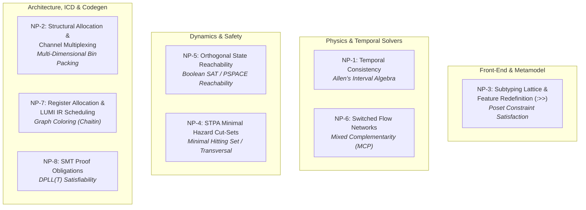
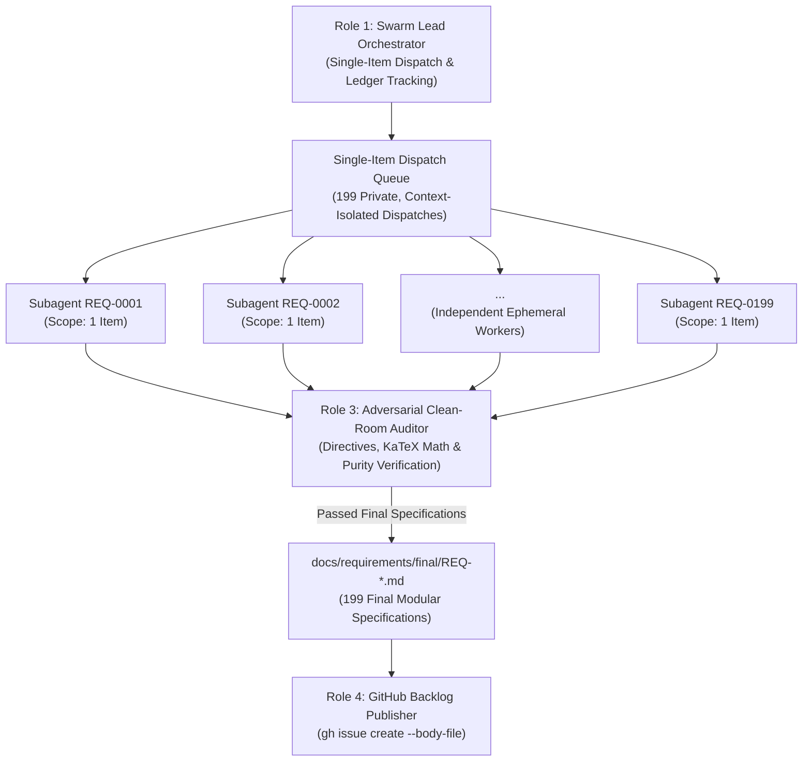

# TEAMWORK SWARM CHARTER: DEAP COMPILER REQUIREMENTS ELABORATION & BACKLOG PUBLICATION

## 1. Prime Mission Directive & System Context

- **System Identity:** Sovereign DEAP Compiler (`deap-compiler`).
- **Workspace Context:** Clean-room repository workspace (`deap-compiler-spec` seed source).
- **Seed Input:** Strictly `docs/requirements/seeds/REQ-0001.md` through `REQ-0199.md` (199 modular requirement items covering Subsystems 1 through 12).
- **Core Mission:** Deploy an autonomous multi-agent swarm via `/teamwork-preview` to ingest the 199 modular seed requirement items (`REQ-0001` through `REQ-0199`) from `docs/requirements/seeds/`, expand each into an exhaustive, contract-grade specification block using the mandatory 4-part Contract Schema, apply the 5 Non-Negotiable Architectural Directives, audit each specification for zero domain contamination and mathematical rigor, save the final specification to `docs/requirements/final/REQ-XXXX.md`, and publish all 199 requirements as formal tracked issues on GitHub via the `gh` CLI using 199 private, context-isolated subagent dispatches (strictly 1 requirement item per dispatch).
- **Phase Boundary:** Specification formalization and backlog tracking ONLY. Writing implementation code, creating crates, or generating mock implementations is strictly prohibited during this phase.

---

## 2. Inviolable Clean-Room Invariants

Every agent in the swarm MUST strictly enforce these five zero-compromise rules:

1. **Pure Schema-Driven Compiler (Zero Hardcoded Domain Concepts):**
   The compiler is an abstract Model-Based Systems Engineering (MBSE) compiler and formal verification engine. It operates exclusively on generic systems engineering primitives: Classifiers, Ports, Connectors, Rational Dimensional Exponents, Kirchhoff Flow Networks, and Temporal Intervals. All entities, signals, physical bounds, and units derive deterministically from user-supplied schemas. Every example, scenario, or parameter must use purely synthetic abstract placeholders (e.g., `Package_0`, `Classifier_Alpha`, `Port_1`, `Flow_A`, `param_x : Real`).
2. **The Zero Mock-Data Imperative:**
   Under no circumstances shall any elaborated requirement contain hypothetical or fabricated concrete domain models. All illustrative examples must use purely abstract mathematical placeholders (e.g., `Classifier_Alpha`, `Port_1`, `[M]^1 [L]^2`).
3. **Pure KaTeX Display Math:**
   All display mathematical equations must be enclosed in isolated `$$` fences on dedicated lines; multi-line equations must use `\begin{aligned} ... \end{aligned}`. Markdown table cells must never contain `$` math delimiters (plain text or Unicode symbols only). Non-mathematical identifiers must never use math delimiters.
4. **Zero Unicode Em Dashes:**
   ASCII `--` or `-` exclusively across all issue titles, bodies, and labels. Unicode em dashes (`\u2014`) are strictly prohibited.
5. **Mandatory Single-Item Scope Invariant:**
   Every worker subagent dispatch MUST target at most 1 specification item (exactly 1 requirement item per dispatch). Legacy subsystem batching (e.g., multi-requirement batches) is strictly prohibited across the entire swarm.

---

## 3. The 5 Non-Negotiable Architectural Directives

During requirement detailing, the swarm must enforce these five specific architectural fixes:

### Directive 1: Deterministic UUIDv5 Anchors (REQ-0010, REQ-0159, REQ-0166, REQ-0173)
- **Vulnerability:** Time-based UUIDs (like UUIDv7) generate varying values on repeated runs, exploding git churn and destroying Merkle root digests.
- **Mandate:** Replace all references to "UUIDv7" with **"Deterministic UUIDv5"** (RFC 4122 namespace hashing seeded by a fixed namespace OID and the node fully qualified topological path, e.g., `Package_A::Part_B`). Time-based UUIDs are strictly banned.

### Directive 2: Bounded Work-Stealing Parallelism (REQ-0012, REQ-0136)
- **Vulnerability:** Unconstrained dynamic thread allocation during STPA Cartesian combinatorial expansions or AST traversals creates thread exhaustion and out-of-memory panics.
- **Mandate:** Multithreading must be implemented exclusively via a **bounded, work-stealing thread pool** (bounded worker pool, $N_{\text{max\_workers}}$). Unbounded manual thread spawning is strictly banned.

### Directive 3: String Interner Memory Allocation Exception (REQ-0036)
- **Vulnerability:** Strict zero-copy memory management prevents deduplicating string symbols across independent compilation units.
- **Mandate:** Explicitly specify in REQ-0036 that copying string bytes from the source file buffer into the global symbol interner pool during the initial lexical pass is the **sole permitted exception** to the zero-copy invariant.

### Directive 4: Synchronization Token Error Recovery (REQ-0013, REQ-0016)
- **Vulnerability:** A parser that halts on the first syntax error degrades developer experience and toolchain integration.
- **Mandate:** In REQ-0013 and REQ-0016, mandate that the ingestion engine implements **Synchronization Token Error Recovery** to resynchronize on statement and delimiter boundaries and accumulate multiple diagnostics per file rather than aborting on first fault.

### Directive 5: Panic-Free Production Paths & Benchmarking Isolation (REQ-0011, REQ-0196)
- **Vulnerability:** Unhandled runtime errors or partial functions introduce non-deterministic failures. Evaluating latency (< 25 ms) and RSS memory (< 100 MB) in unoptimized debug builds causes flaky CI failures.
- **Mandate:**
  - Production compiler library code must strictly enforce a **deterministic, non-panicking execution contract** with total-function termination and structured error propagation on invalid inputs.
  - Performance latency (< 25 ms) and RSS memory (< 100 MB) gates must be evaluated **exclusively in compiled Release mode (`--release`)** via dedicated benchmark harnesses, isolated from standard CI logic tests.

---

## 4. The 8 NP-Completeness Frontiers: Formal Complexity Foundations

Every complex verification, optimization, and transformation problem in the DEAP compiler is anchored to its rigorous computational complexity class:



### NP-1: Temporal Consistency over Occurrence Lifecycles (Allen's Interval Algebra)
- **Subsystem & Target Anchor**: Subsystem 6 (`REQ-0117`)
- **Complexity Class**: **NP-complete** for general networks (*Vilain & Kautz, 1986*).
- **Formal Invariant & Tractable Fragment**: The compiler shall restrict static temporal constraint checking to the **ORD-Horn tractable subclass** (*Nebel & Bürckert, 1995*), guaranteeing deterministic $O(N^3)$ polynomial-time path consistency via:
$$
\forall i, j, k \in \mathcal{O}, \quad R(i, k) \leftarrow R(i, k) \cap (R(i, j) \circ R(j, k))
$$
General non-ORD-Horn temporal networks are delegated to an SMT difference logic solver (QF_RDL) with an explicit step budget $\kappa_{\text{temporal}}$.

### NP-2: Structural Allocation & Logical Channel Multiplexing (Multi-Dimensional Bin Packing)
- **Subsystem & Target Anchor**: Subsystem 8 (`REQ-0147`)
- **Complexity Class**: **Strongly NP-hard** (Generalized Assignment / Multi-Dimensional Vector Bin Packing).
- **Formal Invariant & Approximation Heuristic**: The allocation engine shall implement deterministic First-Fit Decreasing (FFD) approximation heuristics guaranteeing an asymptotic bound:
$$
\text{Cost}(\text{FFD}) \le \frac{11}{9}\text{OPT} + \frac{6}{9}
$$
Under strict timing and bandwidth constraints, allocation is formalized as a 0-1 Integer Linear Program (ILP):
$$
\min \sum_{j \in \mathcal{C}} y_j \quad \text{s.t.} \quad \sum_{i \in \mathcal{A}} w_{ik} x_{ij} \le C_{jk} y_j, \quad \sum_{j \in \mathcal{C}} x_{ij} = 1, \quad x_{ij}, y_j \in \{0, 1\}
$$
solved with a bounded branch-and-bound exploration cutoff $\kappa_{\text{alloc}}$.

### NP-3: Subtyping Lattice & Feature Redefinition (`:>>`) in Multiple Inheritance
- **Subsystem & Target Anchor**: Subsystem 4 (`REQ-0061`--`REQ-0063`)
- **Complexity Class**: **NP-complete** for arbitrary poset subtyping with structural feature constraints (*Ait-Kaci, 1989*).
- **Formal Invariant & Monotonic Semi-Lattice**: The type checker shall enforce monotonic C3 linearization over feature subgraphs, proving that $(\text{Types}, \le)$ forms a bounded meet-semilattice:
$$
\tau_1 \wedge \tau_2 = \inf \{ \tau_1, \tau_2 \}, \quad \text{C3}(C) = C + \text{merge}(\text{C3}(P_1), \dots, \text{C3}(P_n), [P_1, \dots, P_n])
$$
enforcing subtyping verification in deterministic polynomial time $O(V + E)$ without cyclic inheritance or backtrack explosion.

### NP-4: STPA Minimal Hazard Cut-Sets & Unsafe Control Action (UCA) Minimization
- **Subsystem & Target Anchor**: Subsystem 7 (`REQ-0135`)
- **Complexity Class**: **NP-complete** (Equivalent to Minimal Hitting Set / Hypergraph Transversal).
- **Formal Invariant & Logarithmic Approximation**: Finding the minimal set of safety constraints $C^* \subseteq \mathcal{C}$ that covers all hazards across candidate tensor $U = A \times G \times S$ is solved via greedy logarithmic approximation:
$$
|C_{\text{greedy}}| \le (1 + \ln |H|) \cdot |C^*|
$$
or bounded Min-Unsat reductions with timeout $\kappa_{\text{safety}}$.

### NP-5: Discrete State Machine Reachability, Deadlock & Livelock in Orthogonal Regions
- **Subsystem & Target Anchor**: Subsystem 6 (`REQ-0124`)
- **Complexity Class**: **PSPACE-complete** for $K$ concurrent orthogonal regions ($|S| = \prod |S_i|$), NP-complete for bounded depth $k$.
- **Formal Invariant & Bounded Model Checking (BMC)**: The state machine compiler shall perform reachability verification via Bounded Model Checking (BMC) compiling transition relations into SAT unrolling equations:
$$
\Phi_k = I(s_0) \wedge \left( \bigwedge_{t=0}^{k-1} T(s_t, s_{t+1}) \right) \wedge \neg \text{Safe}(s_k)
$$
with configurable depth cutoff $k \le k_{\text{max}}$.

### NP-6: Switched & Piecewise Conservative Flow Networks
- **Subsystem & Target Anchor**: Subsystem 5 (`REQ-0105`)
- **Complexity Class**: **NP-complete** (Linear Complementarity Problem LCP / Mixed Complementarity Problem MCP).
- **Formal Invariant & Lemke Pivot**: The metrology engine shall partition flow networks into pure continuous linear subgraphs solved via sparse LU factorization in $O(V^3)$:
$$
\mathbf{K} \mathbf{e} = \mathbf{f}_{\text{ext}}
$$
versus hybrid switched junctions formulated as an LCP:
$$
\mathbf{w} - \mathbf{M} \mathbf{z} = \mathbf{q}, \quad \mathbf{w} \ge 0, \quad \mathbf{z} \ge 0, \quad \mathbf{w}^T \mathbf{z} = 0
$$
solved via Lemke's complementary pivot algorithm with iteration limit $\kappa_{\text{pivot}}$.

### NP-7: Register Allocation & SSA Basic Block Scheduling in LUMI IR
- **Subsystem & Target Anchor**: Subsystem 10 (`REQ-0180`)
- **Complexity Class**: **NP-complete** (Chaitin's Graph $K$-Coloring and DAG Instruction Scheduling under Latency).
- **Formal Invariant & Kempe Heuristic**: The code generation engine shall employ Kempe's heuristic with optimistic spilling for register allocation over variable interference graphs $G = (V, E)$:
$$
\text{degree}(v) < K \implies \text{push}(v)
$$
and critical-path list scheduling for DAGs, guaranteeing linear $O(V + E)$ execution bounds.

### NP-8: Formal Proof Obligations & Invariant Contract Satisfiability
- **Subsystem & Target Anchor**: Subsystem 12 (`REQ-0197`)
- **Complexity Class**: **NP-complete** (Decidable SMT fragments) / Undecidable (Non-linear arithmetic / general first-order logic).
- **Formal Invariant & Syntactic Fragment Guardrails**: The verification generator shall enforce syntactic guardrails restricting proof obligations strictly to decidable fragments:
$$
\mathcal{T}_{\text{obligation}} \in \{ \text{QF\_LRA}, \text{QF\_LIA}, \text{QF\_UF} \}
$$
rejecting unquantified non-linear arithmetic and undecidable theories prior to solver dispatch.

---

## 5. Multi-Agent Swarm Topology & Subagent Dispatch Protocol

The swarm operates under the Mandatory Single-Item Scope Invariant, executing 199 private, context-isolated subagent dispatches (exactly 1 requirement per dispatch):



### Role 1: Swarm Lead Orchestrator (Single-Item Dispatch & Ledger Tracking)
- **Responsibility:** Ingests seed requirement items from `docs/requirements/seeds/`, dispatches each requirement individually as an isolated subagent task (`REQ-0001` through `REQ-0199`), tracks completion status in `.teamwork/status_ledger.json`, coordinates quality handoffs, and ensures all 199 final specifications are delivered to `docs/requirements/final/`.
- **Constraint:** Does not elaborate requirements directly; coordinates single-item dispatches and enforces quality gates. Zero monolithic files shall be assembled.

### Role 2: Single-Item Specification Engineers (Parallel Context-Isolated Subagents)
- **Responsibility:** Ingest assigned single seed item (`REQ-XXXX.md`) from `docs/requirements/seeds/` without modifying it, apply the 5 Non-Negotiable Architectural Directives, and write out fully expanded 4-part specification blocks into `docs/requirements/final/REQ-XXXX.md`.
- **Scope Invariant:** Strictly 1 requirement per subagent context. Batching multiple requirements into a single subagent dispatch is strictly prohibited.

### Role 3: Adversarial Clean-Room & Mathematical Auditor
- **Responsibility:** Audits each individual final specification `docs/requirements/final/REQ-XXXX.md` before publication. Rejects any specification with:
  - Domain concept leaks (only abstract placeholders permitted: `Package_0`, `Classifier_Alpha`, etc.).
  - Mock data or concrete domain models.
  - "UUIDv7" references (must be Deterministic UUIDv5).
  - Unbounded thread spawning (must be bounded work-stealing).
  - Missing interner exception, sync error recovery, or panic-free release isolation.
  - Formatting violations (unisolated `$$`, top-level `\begin{align}`, math delimiters in tables, Unicode em dashes).
  - Third-party crate leaks or concrete compiler module leaks (technology-neutral systems engineering primitives exclusively).

### Role 4: GitHub Backlog Publisher & Traceability Specialist
- **Responsibility:** Takes approved, audited final requirements from `docs/requirements/final/REQ-XXXX.md` and creates formal GitHub issues via `gh issue create` using `--body-file`. Records issue numbers, titles, and URLs in `.teamwork/issue_manifest.json`, ensuring idempotent publication and verified issue creation.

### Canonical Subagent Dispatch Prompt Template

```text
Execute `view_file` on `docs/requirements/STREAMLINED_CHARTER.md` as your very first step before taking any action.

Role: Single-Item Requirement Finalization Worker
Seed Input: docs/requirements/seeds/REQ-XXXX.md
Final Output: docs/requirements/final/REQ-XXXX.md

Directives:
1. Ingest strictly `docs/requirements/seeds/REQ-XXXX.md` using workspace-relative paths. Do not modify the seed file.
2. Elaborate the specification into the mandatory 4-part Contract Schema:
   - **Normative Statement**: Positive RFC 2119 prescriptive specification ("shall" / "must").
   - **Formal Invariant**: KaTeX display math on isolated $$ lines (\begin{aligned} for multi-line).
   - **Computational Complexity & Algorithmic Bounds**: Explicit complexity class (P, NP-complete, PSPACE) and asymptotic bounds (O(1), O(N), O(V+E), NP-1..NP-8 bindings).
   - **Verification & Conformance Criteria**: Deterministic verification check with diagnostic error code binding (E01xx--E05xx per REQ-0191).
3. Enforce zero crate names (`lasso`, `petgraph`, `bumpalo`, `typed-arena`, `memmap2`, `proptest`, `rayon`, `deap::*`).
4. Enforce zero Unicode em dashes (ASCII `--` or `-` exclusively).
5. Write the completed, verified specification to `docs/requirements/final/REQ-XXXX.md`.

PROCEED
```

---

## 6. Mandatory 4-Part Contract Schema

Every single one of the 199 requirements (`REQ-0001` through `REQ-0199`) MUST be elaborated using this exact Markdown contract schema without omitting any fields:

```markdown
### [REQ-XXXX]: [Requirement Title]

- **Normative Statement**: [Positive prescriptive specification using RFC 2119 keywords ("shall" / "must") defining the exact compiler behavior, input schemas, AST lowering, and emitted outputs with zero negative constraints and zero hardcoded domain assumptions]

- **Formal Invariant**:
$$
\begin{aligned}
[KaTeX \text{ display math equation defining mathematical properties, algebraic invariants,}] \\
[graph topologies, conservation laws, or type lattice constraints on dedicated } \$\$ \text{ fences}]
\end{aligned}
$$

- **Computational Complexity & Algorithmic Bounds**: [Explicit computational complexity class (e.g. P, NP-complete, PSPACE-complete), asymptotic bounds (e.g. O(1), O(N), O(V + E), O(N^3)), tractable fragment restriction (e.g. ORD-Horn, meet-semilattice, FFD heuristic), and formal NP-1..NP-8 frontier bindings where applicable]

- **Verification & Conformance Criteria**: [Deterministic verification check and acceptance criteria (AC-1..AC-N), specifying automated compiler passes, static typing assertions, and standardized diagnostic error code bindings (E01xx--E05xx per REQ-0191)]
```

---

## 7. The 12-Subsystem Work Breakdown Structure (WBS)

The swarm must process all 199 requirements across their respective Subsystems:

### 7.1 Standardized Compiler Diagnostic Taxonomy (REQ-0191)

The compiler diagnostic architecture enforces a partitioned 5-tier diagnostic code space (`E0100`--`E0599`) per REQ-0191:

| Range | Domain / Family | Description & Scope | Target Subsystems | Representative Codes |
| :--- | :--- | :--- | :--- | :--- |
| E01xx | Ingestion & Lexer | File format detection, CommonMark parsing, table row mappings, protocol AST ingestion | Subsystem 1, Subsystem 2 | E0100, E0102, E0103, E0104, E0199 |
| E02xx | Metamodel & Typing | Arena allocation, string interning, scope resolution, cycle detection, KerML/SysML v2 lowering, AST slicing | Subsystem 3, Subsystem 4, Subsystem 9 | E0200, E0201, E0202, E0203, E0220, E0230, E0231, E0232, E0299 |
| E03xx | Metrology & Conservation | Q^7 rational vector space, dimensional homogeneity, Kirchhoff flow/potential laws, operational envelopes | Subsystem 5, Subsystem 8 | E0300, E0301, E0399 |
| E04xx | Dynamics, State & Safety | Allen interval consistency, state machine reachability, STPA hazards, FMECA failure modes, schedulability | Subsystem 6, Subsystem 7, Subsystem 8, Subsystem 12 | E0400, E0406, E0440, E0442, E0443, E0444, E0451, E0499 |
| E05xx | ICD, Projections & Backend | Interface control documents, DTOs, LUMI IR, code generation, reverse-sync prose gate | Subsystem 8, Subsystem 9, Subsystem 10, Subsystem 11 | E0500, E0502, E0599 |

### 7.2 Subsystem Requirement Catalogs

### Subsystem 1: System Vision, Bootstrapping & Foundational Invariants (`REQ-0001` -- `REQ-0013`) [13 items]
- `REQ-0001`: Abstract MBSE Compiler Mandate & Pure Schema-Driven Execution [Diagnostic: E01xx]
- `REQ-0002`: Surjective Lexical Provenance Gate & Positive AST Provenance [Diagnostic: E01xx]
- `REQ-0003`: Bitwise Determinism & Zero Diff Churn Verification [Diagnostic: E01xx]
- `REQ-0004`: Workspace Sovereignty & Dynamic Relative Path Resolution [Diagnostic: E01xx]
- `REQ-0005`: Standalone Self-Contained Execution & Environment Independence [Diagnostic: E01xx]
- `REQ-0006`: Incremental Compilation Dependency Tracking & AST Cache Invalidation [Diagnostic: E01xx]
- `REQ-0007`: Multi-File Compilation Unit Resolution & Hierarchical Package Scoping [Diagnostic: E01xx]
- `REQ-0008`: Sovereign Single Source of Truth (SSOT) Multi-File AST Model [Diagnostic: E01xx]
- `REQ-0009`: Zero-Copy Bump Arena Memory Management [Diagnostic: E01xx]
- `REQ-0010`: Deterministic RFC 4122 UUIDv5 Topological Namespace Hashing [Directive 1 (Deterministic UUIDv5)] [Diagnostic: E01xx]
- `REQ-0011`: Deterministic Non-Panicking Execution Contract & Release Latency Bounds [Directive 5 (Panic-Free Release Isolation)] [Diagnostic: E01xx]
- `REQ-0012`: Bounded Work-Stealing Parallelism & Thread Isolation [Directive 2 (Bounded Work-Stealing)] [Diagnostic: E01xx]
- `REQ-0013`: Synchronization Token Error Recovery Architecture [Directive 4 (Sync Token Recovery)] [Diagnostic: E01xx]

### Subsystem 2: Universal Schema Ingestion Engine (`REQ-0014` -- `REQ-0033`) [20 items]
- `REQ-0014`: File Format Detection Engine by Extension & Magic Signatures [Diagnostic: E01xx]
- `REQ-0015`: Event-Driven CommonMark Table Lexer & Token Streaming [Diagnostic: E01xx]
- `REQ-0016`: Synchronization Token Recovery on Table Delimiter Boundaries [Directive 4 (Sync Token Recovery)] [Diagnostic: E0102]
- `REQ-0017`: Dynamic Semantic Header Key Normalization & Order-Independent Binding [Diagnostic: E01xx]
- `REQ-0018`: Multi-Line Table Cell Block Token Preservation & Normalization [Diagnostic: E01xx]
- `REQ-0019`: Table Row-to-Entity Structural Mapping & Identifier Sanitization [Diagnostic: E01xx]
- `REQ-0020`: Disambiguation of Array Indexing Syntax in Tabular Schemas [Diagnostic: E01xx]
- `REQ-0021`: Tabular Schema Ingestion for Structural Parts & Component Assemblies [Diagnostic: E01xx]
- `REQ-0022`: Tabular Schema Ingestion for Directed Ports & Structural Interfaces [Diagnostic: E01xx]
- `REQ-0023`: Tabular Schema Ingestion for Attributes, Data Types & Numerical Envelopes [Diagnostic: E0103]
- `REQ-0024`: Tabular Schema Ingestion for Formal Constraints & Operational Envelopes [Diagnostic: E01xx]
- `REQ-0025`: Tabular Schema Ingestion for Topological Connections & Interconnects [Diagnostic: E0104]
- `REQ-0026`: Tabular Schema Ingestion for Behaviors, Actions & State Transitions [Diagnostic: E01xx]
- `REQ-0027`: Protocol Buffer (Proto3) AST Ingestion for Messages, Fields & RPCs [Diagnostic: E01xx]
- `REQ-0028`: OMG IDL AST Ingestion for Structs, Interfaces & Directional Parameters [Diagnostic: E01xx]
- `REQ-0029`: OpenAPI (JSON/YAML) Schema Ingestion for Paths, Operations & Payloads [Diagnostic: E01xx]
- `REQ-0030`: XML Schema Definition (XSD) & ADL Schema Ingestion for Component Topologies [Diagnostic: E01xx]
- `REQ-0031`: Canonical SysML v2 Textual Model Emission (`schema/model.sysml`) [Diagnostic: E01xx]
- `REQ-0032`: Deterministic Qualified-Name Symbol Sorting for Canonical Model Emission [Diagnostic: E01xx]
- `REQ-0033`: Multi-File Cryptographic Digest Computation (`.pipeline/schema-digest.json`) [Diagnostic: E01xx]

### Subsystem 3: Core Metamodel, Node Arena & AST Graph Engine (`REQ-0034` -- `REQ-0053`) [20 items]
- `REQ-0034`: Contiguous Memory Lowering & Linear Allocation Complexity [Diagnostic: E02xx]
- `REQ-0035`: Deterministic Node Handle Addressing & Reference Safety [Diagnostic: E02xx]
- `REQ-0036`: Concurrent String Interning & Scalar Symbol Deduplication Architecture [Directive 3 (Interner Exception)] [Diagnostic: E02xx]
- `REQ-0037`: Classifier Definition & Feature Usage Metamodel Typing Relations [Diagnostic: E02xx]
- `REQ-0038`: Strongly Typed Port Directions (`in`, `out`, `inout`) & Directional Invariants [Diagnostic: E0201]
- `REQ-0039`: Flow Payload Binding & Stream Rate Multiplicity Validation [Diagnostic: E0202]
- `REQ-0040`: Two-Pass Symbol Hoisting & Lexical Scope Table Construction [Diagnostic: E02xx]
- `REQ-0041`: Lexical Scope Lookup & Fully Qualified Path Resolution (`::`) [Diagnostic: E02xx]
- `REQ-0042`: Circular Dependency & Metamodel Inheritance Cycle Detection [Diagnostic: E0203]
- `REQ-0043`: Multi-File Module Ingestion & Directory-to-Namespace Hierarchy Mapping [Diagnostic: E02xx]
- `REQ-0044`: Lossless AST Serialization & Deserialization (JSON & CBOR Formats) [Diagnostic: E02xx]
- `REQ-0045`: Immutable AST Graph Traversal Engine with Bounded Linear Complexity [Diagnostic: E02xx]
- `REQ-0046`: Mutable AST Transformation & In-Place Rewrite Engine [Diagnostic: E02xx]
- `REQ-0047`: Graph-Theoretic AST Representation & Directed Multigraph Metamodel [Diagnostic: E02xx]
- `REQ-0048`: Topological Sort Dependency Scheduling (Tarjan SCC & Kahn Algorithms) [Diagnostic: E02xx]
- `REQ-0049`: Context-Bounded AST Slicing (`query_slice`) for Token-Isolated Subagents [Diagnostic: E02xx]
- `REQ-0050`: AST Slice Serialization Contract with Reified Dependency Envelopes [Diagnostic: E02xx]
- `REQ-0051`: Incremental Compilation Cache Invalidation via Module Dependency DAG [Diagnostic: E02xx]
- `REQ-0052`: Memory-Mapped Diff Engine & Unmodified Output File Bypass [Diagnostic: E02xx]
- `REQ-0053`: Tombstone Pruning Engine for Renamed & Orphaned AST Nodes [Diagnostic: E02xx]

### Subsystem 4: Complete OMG SysML v2 / KerML Metamodel Lowering & Grammar (`REQ-0054` -- `REQ-0097`) [44 items]
- `REQ-0054`: KerML Root, Element, Relationship & Annotation Abstract Syntax [Diagnostic: E02xx]
- `REQ-0055`: KerML Namespace, Membership, OwningMembership & Qualified Naming [Diagnostic: E02xx]
- `REQ-0056`: KerML Import Declaration Semantics (Public, Private, All, Filtered) [Diagnostic: E02xx]
- `REQ-0057`: KerML Core Classifiers: Type, Classifier, DataType, Class, Structure [Diagnostic: E02xx]
- `REQ-0058`: KerML Association, AssociationStructure & Link Semantics [Diagnostic: E02xx]
- `REQ-0059`: KerML Interaction & Step Abstract Syntax Semantics [Diagnostic: E02xx]
- `REQ-0060`: KerML Core Features: Feature, Parameter, Step & FeatureTyping Semantics [Diagnostic: E02xx]
- `REQ-0061`: KerML Subsetting Relationship (`:>`) Lowering & Co-variance Invariants [NP-3 (Subtyping Lattice & C3 Linearization)] [Diagnostic: E02xx]
- `REQ-0062`: KerML Redefinition Relationship (`:>>`) Lowering & Type Conformance [NP-3 (Subtyping Lattice & C3 Linearization)] [Diagnostic: E02xx]
- `REQ-0063`: KerML Conjugation Relationship (`~`) Lowering & Port Inversion [NP-3 (Subtyping Lattice & C3 Linearization)] [Diagnostic: E02xx]
- `REQ-0064`: KerML Disjoining, Differencing, Intersecting & Unioning Type Algebra [Diagnostic: E02xx]
- `REQ-0065`: KerML Expressions: Expression, Literal, OperatorExpression & Invocations [Diagnostic: E02xx]
- `REQ-0066`: KerML Functions: Function, Parameter Directions & Return Typing [Diagnostic: E02xx]
- `REQ-0067`: KerML Occurrences: OccurrenceDefinition & OccurrenceUsage Semantics [Diagnostic: E02xx]
- `REQ-0068`: KerML PortionKind, TimeSlice, Snapshot & EventOccurrence Semantics [Diagnostic: E02xx]
- `REQ-0069`: KerML Behaviors: Performance, Execution & ActionUsage Semantics [Diagnostic: E02xx]
- `REQ-0070`: SysML v2 Package & Subsystem Model Organization Grammar [Diagnostic: E02xx]
- `REQ-0071`: SysML v2 PartDefinition (`part def`) & PartUsage (`part`) Lowering [Diagnostic: E02xx]
- `REQ-0072`: SysML v2 PortDefinition (`port def`) & DirectedPort Usage Lowering [Diagnostic: E02xx]
- `REQ-0073`: SysML v2 ItemDefinition (`item def`) & ItemUsage (`item`) Lowering [Diagnostic: E02xx]
- `REQ-0074`: SysML v2 ConnectionDefinition (`connection def`) & ConnectionUsage Lowering [Diagnostic: E02xx]
- `REQ-0075`: SysML v2 InterfaceDefinition (`interface def`) & InterfaceUsage Lowering [Diagnostic: E02xx]
- `REQ-0076`: SysML v2 ItemFlow (`flow`) & Streaming Direction Lowering [Diagnostic: E02xx]
- `REQ-0077`: SysML v2 AllocationDefinition (`allocation def`) & AllocationUsage Lowering [Diagnostic: E02xx]
- `REQ-0078`: SysML v2 ActionDefinition (`action def`) & ActionUsage (`action`) Lowering [Diagnostic: E02xx]
- `REQ-0079`: SysML v2 StateDefinition (`state def`), StateUsage (`state`) & ParallelState [Diagnostic: E02xx]
- `REQ-0080`: SysML v2 TransitionUsage (`transition`) with Triggers, Guards & Effects [Diagnostic: E02xx]
- `REQ-0081`: SysML v2 EntryAction, DoAction & ExitAction State Lifecycle Hooks [Diagnostic: E02xx]
- `REQ-0082`: SysML v2 CalculationDefinition (`calc def`) & CalculationUsage Lowering [Diagnostic: E02xx]
- `REQ-0083`: SysML v2 ConstraintDefinition (`constraint def`) & ConstraintUsage Lowering [Diagnostic: E02xx]
- `REQ-0084`: SysML v2 AssertConstraintUsage (`assert constraint`) Lowering [Diagnostic: E02xx]
- `REQ-0085`: SysML v2 RequirementDefinition (`requirement def`) & RequirementUsage Lowering [Diagnostic: E02xx]
- `REQ-0086`: SysML v2 SatisfyRequirementUsage (`satisfy requirement`) Traceability [Diagnostic: E02xx]
- `REQ-0087`: SysML v2 VerificationCaseDefinition (`verification def`) & VerificationUsage [Diagnostic: E02xx]
- `REQ-0088`: SysML v2 ViewDefinition (`view def`), ViewUsage & Viewpoint Lowering [Diagnostic: E02xx]
- `REQ-0089`: SysML v2 Expose Filtering & Viewpoint Conformance Grammar [Diagnostic: E02xx]
- `REQ-0090`: SysML v2 MetadataDefinition (`metadata def`) & Semantic Annotation Usage (`@`) [Diagnostic: E02xx]
- `REQ-0091`: KerML Standard Library: `Base` Package & Primitive Equality Lowering [Diagnostic: E02xx]
- `REQ-0092`: Canonical Scalar Type Lowering & Precision Preservation [Diagnostic: E02xx]
- `REQ-0093`: KerML Standard Library: `Collections` Package (Set, Sequence, OrderedSet, Bag) [Diagnostic: E02xx]
- `REQ-0094`: KerML Standard Library: `ControlFunctions` Package (Decision, Merge, Fork, Join) [Diagnostic: E02xx]
- `REQ-0095`: SysML v2 Quantities Library: `Quantities` & Measurement Scale Lowering [Diagnostic: E02xx]
- `REQ-0096`: SysML v2 Quantities Library: `ISQ` & `ISQBase` Dimension Systems [Diagnostic: E02xx]
- `REQ-0097`: SysML v2 Quantities Library: `SI` Base & Derived Unit Definitions [Diagnostic: E02xx]

### Subsystem 5: 7D Physical Metrology & Abstract Flow Conservation Networks (`REQ-0098` -- `REQ-0113`) [16 items]
- `REQ-0098`: Formal $\\mathbb{Q}^7$ Rational Vector Space over SI Base Dimensions [Diagnostic: E03xx]
- `REQ-0099`: Base Dimension Tuple Representation & Generalized Conjugate Power Pairs [Diagnostic: E03xx]
- `REQ-0100`: Exact Rational Exponent Arithmetic & Kirchhoff Continuity Conservation [Diagnostic: E03xx]
- `REQ-0101`: Static Dimensional Homogeneity Validation for Additive Expressions ($A \\pm B$) [Diagnostic: E03xx]
- `REQ-0102`: Multiplicative Dimensional Exponent Addition & Subtraction ($A \\cdot B, A / B$) [Diagnostic: E03xx]
- `REQ-0103`: Dimensionless Constraint Enforcement for Transcendental Arguments ($\\sin, \\cos, \\exp, \\ln$) [Diagnostic: E03xx]
- `REQ-0104`: Rational Power Evaluation for Fractional Exponents ($A^{p/q}$) [Diagnostic: E03xx]
- `REQ-0105`: Switched & Piecewise Conservative Flow Networks & Linear Complementarity Solvers (NP-6) [NP-6 (Switched Flow Complementarity)] [Diagnostic: E03xx]
- `REQ-0106`: Conservative vs Non-Conservative Flow Network Classification [Diagnostic: E03xx]
- `REQ-0107`: Generalized Conjugate Variable Pair Modeling (Effort $\\times$ Flow = Power) [Diagnostic: E03xx]
- `REQ-0108`: Generalized Kirchhoff Flow Law ($\\sum \\text{Through} = 0$) at Conservative Junctions [Diagnostic: E03xx]
- `REQ-0109`: Generalized Kirchhoff Potential Law ($\\oint \\text{Across} = 0$) across Closed Loops [Diagnostic: E03xx]
- `REQ-0110`: Flow Conservation Network Incidence Matrix Construction & Rank Verification [Diagnostic: E03xx]
- `REQ-0111`: Abstract Power Product Balance ($\sum P_{\text{in}} = \sum P_{\text{out}} + \frac{dE}{dt}$) [Diagnostic: E03xx]
- `REQ-0112`: Parametric Operational Envelopes & Closed Interval $[v_{\\min}, v_{\\max}]$ Validation [Diagnostic: E03xx]
- `REQ-0113`: Static Boundary Value Analysis & Parametric Tolerance Envelope Verification [Diagnostic: E03xx]

### Subsystem 6: Spatio-Temporal Dynamics & Discrete State Machine Solvers (`REQ-0114` -- `REQ-0127`) [14 items]
- `REQ-0114`: Spatio-Temporal Occurrence Lifecycles & Temporal Interval Bounds $[t_{\\text{start}}, t_{\\text{end}}]$ [Diagnostic: E04xx]
- `REQ-0115`: Allen's 13 Qualitative Interval Relations Axiomatic Algebraic Solver [Diagnostic: E04xx]
- `REQ-0116`: Temporal Relation Composition Table & Path Consistency Constraint Propagation [Diagnostic: E04xx]
- `REQ-0117`: Allen's Interval Algebra Temporal Consistency & ORD-Horn SMT Solver (NP-1) [NP-1 (Temporal Consistency)] [Diagnostic: E04xx]
- `REQ-0118`: Directed Causal Precedence DAG Construction & Cycle Detection [Diagnostic: E04xx]
- `REQ-0119`: Action Step Sequence Execution Semantics & Fork-Join Concurrency [Diagnostic: E04xx]
- `REQ-0120`: Hierarchical State Machine (Statechart) Containment & Orthogonal Regions [Diagnostic: E04xx]
- `REQ-0121`: State Transition Trigger Event Dispatching & Event Queue Semantics [Diagnostic: E04xx]
- `REQ-0122`: Deterministic Transition Guard Disjointness Verification ($G_1 \\wedge G_2 \\equiv \\text{false}$) [Diagnostic: E04xx]
- `REQ-0123`: Complete State Machine Reachability Analysis & Dead State Diagnostics [Diagnostic: E04xx]
- `REQ-0124`: Discrete State Machine Reachability, Deadlock & Livelock in Orthogonal Regions (NP-5) [NP-5 (Orthogonal State Reachability)] [Diagnostic: E04xx]
- `REQ-0125`: Failsafe Fallback Transitions & High-Priority Preemptive Evacuation [Diagnostic: E04xx]
- `REQ-0126`: State History Pseudostates (Shallow & Deep History) Restoration Semantics [Diagnostic: E04xx]
- `REQ-0127`: State Machine Simulation Stepper & Trace Log Generation [Diagnostic: E04xx]

### Subsystem 7: Formal Safety, Traceability & Regulatory Verification (`REQ-0128` -- `REQ-0144`) [17 items]
- `REQ-0128`: 7-Tier Bipartite Traceability DAG Architecture [Diagnostic: E04xx]
- `REQ-0129`: Upward Allocation Completeness Gate ($\forall \text{Req}, \exists \text{Element}$) [Diagnostic: E04xx]
- `REQ-0130`: Downward Realization Completeness Gate ($\forall \text{Element}, \exists \text{Req}$) [Diagnostic: E04xx]
- `REQ-0131`: Verification Witness Completeness Gate ($\forall \text{Req}, \exists \text{Witness}$) [Diagnostic: E04xx]
- `REQ-0132`: Extraneous Node Detection & Dead Code Elimination in Safety Contexts [Diagnostic: E04xx]
- `REQ-0133`: Cryptographic Merkle Root Attestation for End-to-End Verification Graphs [Diagnostic: E04xx]
- `REQ-0134`: Hierarchical Control Structure (HCS) AST Extraction & Controller-Process Topology [Diagnostic: E04xx]
- `REQ-0135`: STPA Minimal Hazard Cut-Sets & Unsafe Control Action Minimization (NP-4) [NP-4 (STPA Minimal Hazard Cut-Sets)] [Diagnostic: E04xx]
- `REQ-0136`: STPA Combinatorial Unsafe Control Action Tensor Expansion & Pruning [Directive 2 (Bounded Work-Stealing)] [Diagnostic: E04xx]
- `REQ-0137`: Automated Boolean Safety Invariant Synthesis from Hazard Scenarios [Diagnostic: E04xx]
- `REQ-0138`: Structured `ConstraintExpr` AST Invariant Generation with De Morgan Normalization [Diagnostic: E04xx]
- `REQ-0139`: FMECA Failure Mode Synthesis across 4 Universal Dimensions (Interface, State, Action, Resource) [Diagnostic: E04xx]
- `REQ-0140`: Quantitative Risk Priority Number (RPN) Integer Scoring Engine ($RPN = S \times O \times D$) [Diagnostic: E04xx]
- `REQ-0141`: Run-Time Assurance (RTA) Simplex/Duplex Architecture Pattern Synthesis [Diagnostic: E04xx]
- `REQ-0142`: Smooth State Transition Blending & $C^1$-Continuity Bounds [Diagnostic: E04xx]
- `REQ-0143`: Control Barrier Function (CBF) Forward Invariance Contract Formulation [Diagnostic: E04xx]
- `REQ-0144`: Declarative Pluggable Regulatory Safety Profiles Engine [Diagnostic: E04xx]

### Subsystem 8: Level 1C Interface Control Documents & Interconnect Contracts (`REQ-0145` -- `REQ-0158`) [14 items]
- `REQ-0145`: Automated $N^2$ System Interface Matrix Construction & Topology Indexing [Diagnostic: E05xx]
- `REQ-0146`: $N^2$ Interface Symmetry & Directed Flow Antisymmetry Verification [Diagnostic: E0220]
- `REQ-0147`: Structural Allocation, Interconnect Clustering & Logical Channel Multiplexing (NP-2) [NP-2 (Structural Allocation)] [Diagnostic: E05xx]
- `REQ-0148`: Master Signal Flow Dictionary: Canonical 10-Column Structural Specification [Diagnostic: E05xx]
- `REQ-0149`: Port Definition Rosters & Hierarchical Port Type Binding [Diagnostic: E05xx]
- `REQ-0150`: Connection Binding Rosters, Serialization Layout & Bitfield Packing [Diagnostic: E05xx]
- `REQ-0151`: Dangling Port Gate & Unconnected Interface Compile-Time Failure [Diagnostic: E0220]
- `REQ-0152`: SI Unit Verification in $\mathbb{Q}^7$ Rational Metric Space across Signal Flows [Diagnostic: E0301]
- `REQ-0153`: Failsafe Default Value Domain Validity & Boundary Assertion Gate [Diagnostic: E0440]
- `REQ-0154`: Logical Channel Bandwidth Utilization & Capacity Budgeting [Diagnostic: E0442]
- `REQ-0155`: Rate Monotonic Scheduling (RMS) Schedulability Bound Verification [Diagnostic: E0443]
- `REQ-0156`: Earliest Deadline First (EDF) Dynamic Schedulability Verification [Diagnostic: E0444]
- `REQ-0157`: Protocol Framing Overhead Calculation & Header Serialization Penalty [Diagnostic: E05xx]
- `REQ-0158`: Worst-Case Execution Time (WCET) Propagation across Interconnect Latency Paths [Diagnostic: E0451]

### Subsystem 9: Downstream Specification Projections (`REQ-0159` -- `REQ-0174`) [16 items]
- `REQ-0159`: Deterministic RFC 4122 UUIDv5 Document Anchors for Specification Artifacts [Directive 1 (Deterministic UUIDv5)] [Diagnostic: E05xx]
- `REQ-0160`: Bottom-Up Feature-First Dependency Ordering & DAG Scheduling [Diagnostic: E0203]
- `REQ-0161`: Epics Projection: Structural Decomposition & Subsystem Capability Mapping [Diagnostic: E05xx]
- `REQ-0162`: Epics Projection: System Architecture Diagrams & Streaming Artifact Sink Interface [Diagnostic: E05xx]
- `REQ-0163`: Epics Projection: High-Level Macro Statechart Diagrams & Operational Scenarios [Diagnostic: E05xx]
- `REQ-0164`: Feature Projection: 3-Layer Definition of Done Mandatory Structural Enforcement [Diagnostic: E0230]
- `REQ-0165`: Feature Layer 1: Domain State, Data Models & Primitive Structural Typing [Diagnostic: E05xx]
- `REQ-0166`: Feature Layer 2: Logic, Dynamic Operations & Hierarchical State Machines [Directive 1 (Deterministic UUIDv5)] [Diagnostic: E05xx]
- `REQ-0167`: Feature Layer 3: Presentation, Visual Layout & Machine Interface Binding [Diagnostic: E05xx]
- `REQ-0168`: Feature Class Diagram Emission with Ancestor Containment & No Isolated Classes [Diagnostic: E0231]
- `REQ-0169`: User Stories Projection: Deterministic Gherkin BDD Synthesis from AST Constraints [Diagnostic: E05xx]
- `REQ-0170`: User Story BDD Patterns: Pattern A, Pattern B, and Pattern C Synthesis [Diagnostic: E05xx]
- `REQ-0171`: User Stories Projection: Boundary Value Analysis (BVA) Scenario Synthesis [Diagnostic: E05xx]
- `REQ-0172`: Use Cases Projection: Operational Flows, Primary Path & Step Traversal [Diagnostic: E05xx]
- `REQ-0173`: Use Cases Projection: Alternate Flows & Exception Handler Branching [Directive 1 (Deterministic UUIDv5)] [Diagnostic: E0232]
- `REQ-0174`: Downstream Projections: Bidirectional Realization Matrices, STPA Matrices & ICD Tables Synthesis [Diagnostic: E05xx]

### Subsystem 10: Multi-Target Code Generation, Simulation & Transport Bindings (`REQ-0175` -- `REQ-0189`) [15 items]
- `REQ-0175`: LUMI Intermediate Representation (LUMI IR): SSA Basic Blocks & Control Flow Graph [Diagnostic: E05xx]
- `REQ-0176`: LUMI IR Memory Semantics: Typed Allocations, Immutability & Value Semantics [Diagnostic: E05xx]
- `REQ-0177`: Streaming Artifact Sink Interface & Bounded Memory IO Emission [Diagnostic: E05xx]
- `REQ-0178`: Manifest-Driven File Persistence (`CodegenManifest`) with XXH3 Content Fingerprinting [Diagnostic: E05xx]
- `REQ-0179`: Continuous-Time Numerical Solvers: Discrete Fixed-Step Euler Integration [Diagnostic: E05xx]
- `REQ-0180`: Register Allocation & SSA Basic Block Scheduling in LUMI IR (NP-7) [NP-7 (LUMI IR Register Allocation)] [Diagnostic: E05xx]
- `REQ-0181`: Linear State-Space Matrix Evaluation & Higher-Order Numerical Solvers (RK4) [Diagnostic: E05xx]
- `REQ-0182`: ROS2 Node Architecture Emission: Publishers, Subscribers & QoS Profiles [Diagnostic: E05xx]
- `REQ-0183`: OMG DDS IDL Schema Generation & CDR Binary Serialization Codecs [Diagnostic: E05xx]
- `REQ-0184`: Freestanding Zero-Allocation C++20 Header/Source Code Emission [Diagnostic: E05xx]
- `REQ-0185`: High-Integrity Embedded MISRA C99 Source Code Generation with Static Memory Layout [Diagnostic: E05xx]
- `REQ-0186`: Freestanding RTOS Memory-Mapped Register Header Generation [Diagnostic: E05xx]
- `REQ-0187`: Formal Verification Script Emission: Proof Obligation Synthesis (`.m`) [Diagnostic: E05xx]
- `REQ-0188`: SMT-LIB2 / Z3 First-Order Constraint Encoding & Proof Framework Generation [Diagnostic: E05xx]
- `REQ-0189`: Atomic In-Place File Overwrite & Filesystem Metadata Lock Serialization Prevention [Diagnostic: E05xx]

### Subsystem 11: Standardized Compiler Diagnostic Error Catalog (`REQ-0190` -- `REQ-0194`) [5 items]
- `REQ-0190`: Rich Source-Mapped Diagnostic Reporting with Byte Spans, Synchronization Tokens & Error Accumulation [Diagnostic: E01xx--E05xx]
- `REQ-0191`: Standardized Compiler Diagnostic Taxonomy, Source-Mapping & Recovery Architecture [Diagnostic: E0100--E0599]
- `REQ-0192`: Bidirectional Reverse-Sync Prose Gate: Tri-State Reconciliation & Prose Protection [Diagnostic: E0502]
- `REQ-0193`: Non-Destructive Markdown Parser & Memory-Mapped AST Mutation Engine [Diagnostic: E01xx--E05xx]
- `REQ-0194`: Artifact Drift Detection & Zero-Divergence Bijective Model Synchronization [Diagnostic: E01xx--E05xx]

### Subsystem 12: Compiler Performance, CLI, Assurance & Regression Inoculation (`REQ-0195` -- `REQ-0199`) [5 items]
- `REQ-0195`: Unified Headless CLI Architecture & Deterministic Subcommand Interface [Diagnostic: E01xx--E05xx]
- `REQ-0196`: Performance Assurance Gates: Execution Latency (< 25 ms) & Peak Memory RSS (< 100 MB RSS) [Directive 5 (Panic-Free Release Isolation)] [Diagnostic: E01xx--E05xx]
- `REQ-0197`: NP-8: Formal Proof Obligations & Invariant Contract Satisfiability via Decidable SMT Fragments [NP-8 (SMT Proof Obligations)] [Diagnostic: E0406]
- `REQ-0198`: Property-Based Fuzzing & Generative Metamodel Mutation for AST Invariant Preservation [Diagnostic: E01xx--E05xx]
- `REQ-0199`: 4-Pass Semantic Parity Verification Framework (Frontmatter, Graph Topology, Tables, Numerical Tolerances) [Diagnostic: E01xx--E05xx]

---

## 8. Five-Phase Swarm Execution Protocol

The swarm operates in five strictly sequenced phases:

### Phase 1: Pre-Execution Verification & Scaffolding
1. Verify strictly `docs/requirements/seeds/` exists at repository root and contains exactly 199 seed requirement definitions (`REQ-0001.md` through `REQ-0199.md`).
2. Verify GitHub CLI connectivity:
   ```bash
   gh auth status
   gh issue list --limit 5
   ```
3. Initialize the final requirements directory:
   ```bash
   mkdir -p docs/requirements/final
   ```

### Phase 2: Single-Item Context-Isolated Elaboration (199 Dispatches)
1. The Orchestrator iterates through `REQ-0001` to `REQ-0199`, dispatching a dedicated, context-isolated subagent for each requirement (strictly 1 item per dispatch).
2. Each subagent ingests its designated seed item `docs/requirements/seeds/REQ-XXXX.md` (read-only), applies the 5 Architectural Directives, and expands the requirement into the canonical 4-part contract schema.
3. Subagents write individual verified specifications to `docs/requirements/final/REQ-XXXX.md`.

### Phase 3: Adversarial Clean-Room & Mathematical Audit
1. The Auditor reviews each finalized requirement file (`docs/requirements/final/REQ-XXXX.md`).
2. Audit checks:
   - Canonical 4-part schema complete (`Normative Statement`, `Formal Invariant`, `Computational Complexity & Algorithmic Bounds`, `Verification & Conformance Criteria`).
   - Zero real-world domain concepts or mock data (abstract MBSE placeholders only).
   - Zero occurrences of "UUIDv7" (Deterministic UUIDv5 confirmed).
   - Zero occurrences of unbounded thread spawning (bounded work-stealing confirmed).
   - Zero third-party crate leaks and zero concrete compiler module leaks.
   - Display math enclosed in isolated `$$` fences on dedicated lines; multi-line equations in `\begin{aligned}`; zero math delimiters in tables.
   - Zero Unicode em dashes (ASCII `--` only).
   - Diagnostic error code assigned within the standardized `E01xx`--`E05xx` taxonomy.
   - Seed files in `docs/requirements/seeds/` remain 100% unaltered.
3. If an audit fails, the Auditor returns actionable remediation items to a fresh single-item worker.
4. Once all 199 requirement files pass, the Auditor certifies the items for publication.

### Phase 4: GitHub Issue Creation & Tracking
1. The GitHub Backlog Publisher processes each certified requirement from `REQ-0001` to `REQ-0199`.
2. For each requirement, register the issue on the GitHub issue tracker directly from `docs/requirements/final/REQ-XXXX.md`:
   ```bash
   gh issue create \
     --title "[REQ-XXXX] <Requirement Title>" \
     --body-file "docs/requirements/final/REQ-XXXX.md" \
     --label "requirement,clean-room"
   ```
3. Verifies issue creation via `gh issue view <issue-id>`.
4. Appends the resulting Issue ID, Title, and URL to `.teamwork/issue_manifest.json`.

### Phase 5: Backlog Parity Verification & Audit
1. The Orchestrator verifies that all 199 final requirement files in `docs/requirements/final/` pass clean-room verification.
2. Verifies 0-byte diff parity across downstream and upstream repositories.
3. Verifies:
   - Exactly 199 final requirements documented in `docs/requirements/final/`.
   - All GitHub issues verified on remote.
   - 0 domain concepts, 0 mock data, 0 Unicode em dashes, 0 third-party crate leaks, 0 unisolated `$$`.
   - Zero singular or monolithic files assembled (all requirements remain modular).
4. Emits the final completion report.
