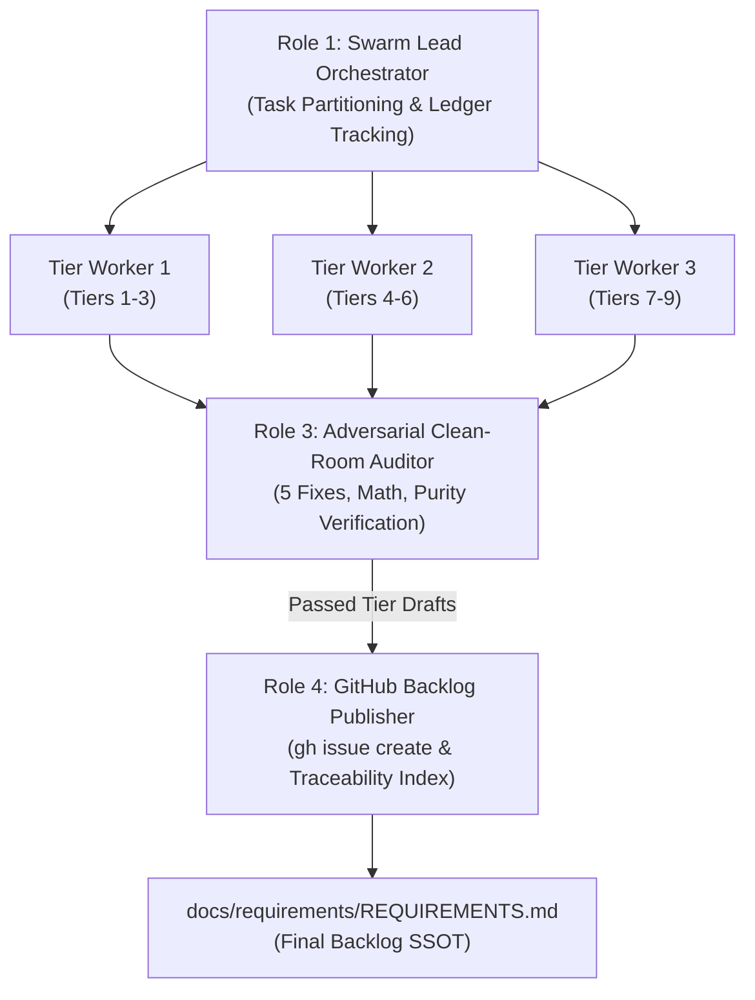

# TEAMWORK SWARM CHARTER: DEAP COMPILER REQUIREMENTS ELABORATION & BACKLOG PUBLICATION

## 1. Prime Mission Directive & System Context

- **System Identity:** Sovereign DEAP Compiler (`deap-compiler`).
- **Workspace Context:** Clean-room repository root (`/Users/perkunas/jail/deap-compiler`).
- **Seed Input:** `REQUIREMENTS_SKELETON.md` (120 seed requirements covering Tiers 1 through 9).
- **Core Mission:** Deploy an autonomous multi-agent swarm via `/teamwork-preview` to ingest the 120 seed requirements, expand each into an exhaustive, contract-grade IEEE 29148 specification block using the mandatory 4-part Detailing Template, apply the 5 Non-Negotiable Architectural Fixes, audit each draft for zero domain contamination and mathematical rigor, and publish all 120 requirements as formal tracked issues on GitHub via the `gh` CLI.
- **Phase Boundary:** Specification formalization and backlog tracking ONLY. Writing Rust implementation code, creating crates, or generating mock implementations is strictly prohibited during this phase.

---

## 2. Inviolable Clean-Room Invariants

Every agent in the swarm MUST strictly enforce these four zero-compromise rules:

1. **Pure Schema-Driven Compiler (Zero Hardcoded Domain Concepts):**
   The compiler is an abstract Model-Based Systems Engineering (MBSE) compiler and formal verification engine. It operates exclusively on generic systems engineering primitives: Classifiers, Ports, Connectors, Rational Dimensional Exponents, Kirchhoff Flow Networks, and Temporal Intervals. All entities, signals, physical bounds, and units derive deterministically from user-supplied schemas. Every example, scenario, or parameter must use purely synthetic abstract placeholders (e.g., `Package_0`, `Classifier_Alpha`, `Port_1`, `Flow_A`, `param_x : Real`).
2. **The Zero Mock-Data Imperative:**
   Under no circumstances shall any elaborated requirement contain hypothetical or fabricated real-world physical systems. All illustrative examples must use purely abstract mathematical placeholders (e.g., `Classifier_Alpha`, `Port_1`, `[M]^1 [L]^2`).
3. **Pure KaTeX Display Math:**
   All display mathematical equations must be enclosed in isolated `$$` fences on dedicated lines; multi-line equations must use `\begin{aligned} ... \end{aligned}`. Non-mathematical identifiers must never use math delimiters.
4. **Zero Unicode Em Dashes:**
   ASCII `--` or `-` exclusively across all issue titles, bodies, and labels. Unicode em dashes (`\u2014`) are strictly prohibited.

---

## 3. The 5 Non-Negotiable Architectural Directives

During requirement detailing, the swarm must enforce these five specific architectural fixes:

### Directive 1: Deterministic UUIDv5 Anchors (REQ-091, REQ-098, REQ-105)
- **Vulnerability:** REQ-004 mandates 100% bitwise determinism and 0 bytes diff churn ($\text{SHA256}(\text{Run}_A) \equiv \text{SHA256}(\text{Run}_B)$). UUIDv7 is timestamp-based; running the compiler at different times generates different UUIDs, exploding git churn and destroying Merkle root digests.
- **Mandate:** Replace all references to "UUIDv7" with **"Deterministic UUIDv5"** (RFC 4122 namespace hashing seeded by a fixed namespace OID and the node's fully qualified topological path, e.g., `Package_A::Part_B`). Time-based UUIDs are strictly banned.

### Directive 2: Bounded Work-Stealing Parallelism (REQ-075)
- **Vulnerability:** Unconstrained `std::thread::spawn` during STPA Cartesian combinatorial expansions creates thread exhaustion (fork-bombing) and out-of-memory panics in CI/CD.
- **Mandate:** REQ-075 multithreading must be implemented exclusively via a **bounded, work-stealing thread pool** (e.g., `rayon`). Unbounded manual thread spawning is strictly banned.

### Directive 3: String Interner Memory Allocation Exception (REQ-028)
- **Vulnerability:** REQ-010 mandates zero-copy memory management, while REQ-028 mandates global string interning. Interning requires copying string bytes from the input buffer into the global symbol interner pool to return a `SymbolId`. Strictly enforcing zero-copy here creates an unresolvable Rust borrow-checker lifetime spiral.
- **Mandate:** Explicitly specify in REQ-028 that copying string bytes from the source file buffer into the interner pool during the initial lexical pass is the **sole permitted exception** to the zero-copy invariant.

### Directive 4: Synchronization Token Error Recovery (REQ-011)
- **Vulnerability:** A parser that halts on the first syntax error degrades developer experience and toolchain integration.
- **Mandate:** In REQ-011, mandate that the ingestion engine implements **Synchronization Token Error Recovery** to resynchronize on record/delimiter boundaries and accumulate multiple diagnostics per file rather than aborting on first fault.

### Directive 5: Panic-Free Production Paths & Benchmarking Isolation (REQ-114, REQ-115, REQ-119)
- **Vulnerability:** `.unwrap()` and `.expect()` in Rust introduce runtime panics. Evaluating latency (< 25 ms) and RSS memory (< 100 MB) in unoptimized debug builds (`cargo test`) causes flaky CI failures.
- **Mandate:**
  - Production compiler library code must be **100% panic-free** (`.unwrap()` and `.expect()` are banned in production paths; errors must be propagated via `Result`).
  - Performance latency (REQ-114) and RSS memory (REQ-115) gates must be evaluated **exclusively in compiled Release mode (`--release`)** via dedicated benchmarking harnesses (e.g., `criterion`), isolated from standard CI logic tests.

---

## 4. Multi-Agent Swarm Topology & Role Assignments

The swarm is structured into four distinct roles operating under a coordinated pipeline:



### Role 1: Swarm Lead Orchestrator (Lead Systems Architect)
- **Responsibility:** Ingests `REQUIREMENTS_SKELETON.md`, partitions the 120 requirements into 9 Tier batches, tracks batch status in `.teamwork/status_ledger.json`, coordinates handoffs, and compiles the final `REQUIREMENTS.md`.
- **Constraint:** Does not elaborate requirements directly; coordinates workers and enforces quality gates.

### Role 2: Tier Detailing Workers (Parallel Specification Engineers)
- **Responsibility:** Ingest assigned Tier requirements from `REQUIREMENTS_SKELETON.md`, apply the 5 Architectural Directives, and write out fully expanded 4-part specification blocks into intermediate files (`.teamwork/drafts/tier_<NN>_elaborated.md`).
- **Partitioning Options:**
  - Worker A: Tier 1 (REQ-001..010), Tier 2 (REQ-011..025), Tier 3 (REQ-026..040)
  - Worker B: Tier 4 (REQ-041..055), Tier 5 (REQ-056..070), Tier 6 (REQ-071..080)
  - Worker C: Tier 7 (REQ-081..090), Tier 8 (REQ-091..105), Tier 9 (REQ-106..120)

### Role 3: Adversarial Clean-Room & Mathematical Auditor
- **Responsibility:** Audits each `.teamwork/drafts/tier_<NN>_elaborated.md` before publication. Rejects any draft with:
  - Domain concept leaks (only abstract placeholders permitted: `Package_0`, `Classifier_Alpha`, etc.).
  - Mock data or real-world physical systems.
  - "UUIDv7" references (must be Deterministic UUIDv5).
  - Unbounded thread spawning (must be bounded work-stealing).
  - Missing interner exception, sync error recovery, or panic-free release isolation.
  - Formatting violations (unisolated `$$`, top-level `\begin{align}`, Unicode em dashes).

### Role 4: GitHub Backlog Publisher & Traceability Specialist
- **Responsibility:** Takes approved, audited Tier drafts and creates formal GitHub issues via `gh issue create`. Records issue numbers, titles, and URLs in `.teamwork/issue_manifest.json`, ensuring idempotent publication and verified issue creation.

---

## 5. Mandatory 4-Part Detailing Schema

Every single one of the 120 requirements (`REQ-001` through `REQ-120`) MUST be elaborated using this exact Markdown template without omitting any fields:

```markdown
### [REQ-XXX]: [Requirement Title]
**Description:** [1-3 concise sentences defining the exact compiler behavior, inputs, and outputs]
**Mathematical / Logical Invariant:** [Formal mathematical formula, O(N) complexity bound, topological graph property, or boolean state invariant. Use KaTeX with isolated $$ fences. If strictly structural, state N/A]
**Acceptance Criteria:**
- **AC-1:** [Concrete, unambiguous verification condition, e.g., The compiler shall emit diagnostic E0XXX if...]
- **AC-2:** [Structural / data invariant condition, e.g., The AST node arena must preserve...]
- **AC-3:** [Edge case / error recovery condition]
**Implementation Constraint:** [Rust-specific architectural and memory boundary, e.g., "Must use Copy-able `SymbolId` index handles", "Must not invoke `.unwrap()` or `.expect()` in production paths", "Must allocate via generational arena"]
```

---

## 6. The 9-Tier Work Breakdown Structure (WBS)

The swarm must process all 120 requirements across their respective Tiers:

### Tier 1: System Invariants & Execution Contract (`REQ-001` -- `REQ-010`) [10 items]
- `REQ-001`: Abstract MBSE Compiler Invariant
- `REQ-002`: Zero Domain Concepts Invariant
- `REQ-003`: Pure Schema-Derived Specification Invariant
- `REQ-004`: Bitwise Determinism & Zero Diff Churn Invariant
- `REQ-005`: Workspace Sovereignty & Relative Path Resolution
- `REQ-006`: Clean Landing Zone Invariant
- `REQ-007`: Polyrepo Tier Partitioning
- `REQ-008`: Stage 0 to Stage 2 Bootstrapping Strategy
- `REQ-009`: SysML v2 / KerML AST as Sovereign SSOT
- `REQ-010`: Zero-Copy Memory Safety Invariant

### Tier 2: Schema Ingestion & Grammar Parsers (`REQ-011` -- `REQ-025`) [15 items]
- `REQ-011`: Deterministic Tabular Schema Parsing *(Apply Directive 4: Synchronization Token Error Recovery)*
- `REQ-012`: Dynamic Semantic Header Key Binding
- `REQ-013`: Multi-Line Table Cell Block Preservation
- `REQ-014`: Structural Namespace Hierarchy Mapping
- `REQ-015`: Standardized Components / Parts Table Schema
- `REQ-016`: Standardized Ports & Interfaces Table Schema
- `REQ-017`: Standardized Attributes & Parametric Envelope Table Schema
- `REQ-018`: Standardized Constraints Table Schema
- `REQ-019`: Standardized Topological Connections Table Schema
- `REQ-020`: Standardized Behaviors / Actions Table Schema
- `REQ-021`: Protocol Buffers Schema Ingestion
- `REQ-022`: Interface Definition Language (IDL) Ingestion
- `REQ-023`: OpenAPI Specification Ingestion
- `REQ-024`: Architecture Description Language (AUTOSAR) Ingestion
- `REQ-025`: Out-of-Process Ingestion Plugin Protocol

### Tier 3: Core Metamodel & Intermediate Representation (`REQ-026` -- `REQ-040`) [15 items]
- `REQ-026`: Zero-Copy Node Arena Allocation
- `REQ-027`: Generational Node Handles
- `REQ-028`: High-Throughput String Interning *(Apply Directive 3: Interner Allocation Exception)*
- `REQ-029`: Explicit ClassifierDef vs FeatureUsage Typing
- `REQ-030`: Strongly-Typed PortDirection Enum
- `REQ-031`: Hierarchical Port Blocks & Protocol Preservation
- `REQ-032`: First-Class ItemFlow Defs & Payload Typed Handles
- `REQ-033`: Attribute Typing & Parametric Envelope Representation
- `REQ-034`: Formal Constraint Expression AST Lowering
- `REQ-035`: First-Class Behavior & Action Metamodel
- `REQ-036`: State Machine & Transition Metamodel Representation
- `REQ-037`: Bidirectional Semantic Traceability DAG
- `REQ-038`: First-Class Interface Endpoints & Multi-Protocol Binding
- `REQ-039`: Allocation Relationships & Physical Deployment Mappings
- `REQ-040`: Metamodel Serialization & Bitwise Deterministic Deserialization

### Tier 4: Semantic Analysis, Scoping & Type System (`REQ-041` -- `REQ-055`) [15 items]
- `REQ-041`: Multi-Pass Semantic Analysis Architecture
- `REQ-042`: Lexical Scoping & Hierarchical Symbol Resolution
- `REQ-043`: Cyclic Dependency Detection via Tarjan's SCC Algorithm
- `REQ-044`: Type Compatibility & Subtyping Lattice Verification
- `REQ-045`: Directional Port Compatibility Verification Gate
- `REQ-046`: Multiplicity & Array Bounds Verification
- `REQ-047`: Topological Connection Network Validation
- `REQ-048`: Kirchhoff Flow Rate Conservation Verification Gate
- `REQ-049`: Structural Signal Multiplexing & Channel Demux Compatibility
- `REQ-050`: State Transition Completeness & Reachability Verification
- `REQ-051`: Deterministic Statechart Execution Semantics (Run-to-Completion)
- `REQ-052`: Behavioral Sequence Diagram Dynamic-to-Static Alignment Gate
- `REQ-053`: Traceability Completeness Gate
- `REQ-054`: Deadlock & Livelock Detection in Concurrent Action Graphs
- `REQ-055`: Unused Symbol & Dead Interface Elimination Pass

### Tier 5: Physical Quantities, Units & Dimensions (`REQ-056` -- `REQ-070`) [15 items]
- `REQ-056`: 7-Vector Rational Exponent Dimensional Representation ($\mathbb{Q}^7$)
- `REQ-057`: Compile-Time Dimensional Homogeneity Enforcement
- `REQ-058`: SI Base Unit System Canonicalization
- `REQ-059`: Derived Unit Definitions & Prefix Scaling Invariants
- `REQ-060`: Affine Temperature Scale Transformations
- `REQ-061`: Coordinate Frame Definition & Transform Hierarchy
- `REQ-062`: Compile-Time Coordinate Frame Transform Compatibility
- `REQ-063`: SE(3) Rigid Body Kinematic Transform Verification
- `REQ-064`: Numerical Precision & Interval Arithmetic Envelope Propagation
- `REQ-065`: Unit Conversion Transcoding Pipeline Generation
- `REQ-066`: Non-Standard Physical Domain Quantities
- `REQ-067`: Mass Properties & Inertia Tensor Symmetry Invariants
- `REQ-068`: Power & Thermal Dissipation Budget Verification Gate
- `REQ-069`: Signal Latency Budget Allocation Verification
- `REQ-070`: Telemetry Bandwidth & Link Margin Verification Gate

### Tier 6: System Safety & Formal Assurance (`REQ-071` -- `REQ-080`) [10 items]
- `REQ-071`: Cryptographic Merkle Root Attestation & Audit Proof Bundling
- `REQ-072`: Hierarchical Control Structure (HCS) Derivation
- `REQ-073`: Combinatorial Unsafe Control Action (UCA) Synthesis
- `REQ-074`: Automated Synthesis of Boolean Safety Invariants
- `REQ-075`: Parallelized Evaluation of Hazard Expansions *(Apply Directive 2: Bounded Work-Stealing Pool)*
- `REQ-076`: Abstract Safety Hazard Verification Gate
- `REQ-077`: Run-Time Assurance Simplex/Duplex Architecture Modeling
- `REQ-078`: Control Barrier Function (CBF) Safety Envelope Monitoring
- `REQ-079`: Cubic Hermite Polynomial Bumpless Transfer Synthesis
- `REQ-080`: Pluggable Declarative Regulatory Profiles

### Tier 7: Interface Control Document Synthesis (`REQ-081` -- `REQ-090`) [10 items]
- `REQ-081`: Automated System Interface Matrix ($N^2$ Diagram)
- `REQ-082`: Master Signal Flow Dictionary (The Canonical 10-Column Contract)
- `REQ-083`: Port Definition Roster Table Synthesis
- `REQ-084`: Connection Binding Roster Table Synthesis
- `REQ-085`: Port Parity & Dangling Interface Verification Gate
- `REQ-086`: Logical Channel Schedulability & Bandwidth Verification Gate
- `REQ-087`: Failsafe Default Domain Validity Gate
- `REQ-088`: Protocol Framing Overhead & Schedulability Computation
- `REQ-089`: End-to-End Latency Deadline Verification
- `REQ-090`: Deterministic Electrical/Telemetry Harness Assignment Projections

### Tier 8: Downstream Specification Projection & Output Contracts (`REQ-091` -- `REQ-105`) [15 items]
- `REQ-091`: Epics Projection *(Apply Directive 1: Deterministic UUIDv5)*
- `REQ-092`: Bottom-Up Feature-First Dependency Lifecycle
- `REQ-093`: Topological Ordering of Specification Trees
- `REQ-094`: Features Projection
- `REQ-095`: 3-Layer DoD Layer 1: Domain State & Data Model
- `REQ-096`: 3-Layer DoD Layer 2: Logic & State Management
- `REQ-097`: 3-Layer DoD Layer 3: Presentation & Actuator Interface Binding
- `REQ-098`: User Stories Projection *(Apply Directive 1: Deterministic UUIDv5)*
- `REQ-099`: Deterministic Given-When-Then BDD Synthesis from Constraints
- `REQ-100`: BDD Boundary Value Analysis Scenarios
- `REQ-101`: Use Cases Projection
- `REQ-102`: Native SysML v2 Multi-File Textual Lowering
- `REQ-103`: KerML Standard Library Binding
- `REQ-104`: Non-Destructive Incremental Markdown Reconciliation
- `REQ-105`: Mandatory UUIDv5 Frontmatter Identity Anchors *(Apply Directive 1: Deterministic UUIDv5)*

### Tier 9: Concurrency, Assurance & Quality Gates (`REQ-106` -- `REQ-120`) [15 items]
- `REQ-106`: Rich Source-Mapped Diagnostics with Spans
- `REQ-107`: Standardized Compiler Error Code Catalog
- `REQ-108`: Reverse-Sync Prose Gate
- `REQ-109`: Artifact Synchronization Integrity
- `REQ-110`: Deterministic Serialization Ordering
- `REQ-111`: Strict Architectural Diagram Syntax Formatting
- `REQ-112`: Zero Unicode Em Dash Invariant across all Outputs
- `REQ-113`: Dedicated Isolated Delimiters for Math Expressions
- `REQ-114`: Processing Latency Gate *(Apply Directive 5: Release Mode Criterion Benchmarking)*
- `REQ-115`: Bounded Memory Consumption Gate *(Apply Directive 5: Release Mode RSS Isolation)*
- `REQ-116`: Strict Synthetic-Only Test Fixtures (Ground Zero Purity)
- `REQ-117`: Property-Based Fuzz Testing
- `REQ-118`: 4-Pass Semantic Parity Gate
- `REQ-119`: Headless CLI Exit Code Contract & Panic-Free Contract *(Apply Directive 5: 100% Panic-Free)*
- `REQ-120`: Automated Defect Inoculation Regression Suite

---

## 7. Five-Phase Swarm Execution Protocol

The swarm operates in five strictly sequenced phases:

### Phase 1: Pre-flight Verification & Scaffolding
1. Verify `REQUIREMENTS_SKELETON.md` exists at repository root and contains exactly 120 requirement definitions (`REQ-001` through `REQ-120`).
2. Verify GitHub CLI connectivity:
   ```bash
   gh auth status
   gh issue list --limit 5
   ```
3. Initialize the teamwork scratch workspace:
   ```bash
   mkdir -p .teamwork/drafts docs/requirements
   ```

### Phase 2: Parallel Tier Elaboration
1. The Orchestrator assigns Tier batches to Tier Workers.
2. Each worker expands its assigned requirements using the 4-part template.
3. Workers apply the 5 Architectural Directives to their designated requirements.
4. Workers write results to `.teamwork/drafts/tier_01.md` through `.teamwork/drafts/tier_09.md`.

### Phase 3: Adversarial Clean-Room & Mathematical Audit
1. The Auditor reviews each drafted Tier file.
2. Audit checks:
   - Contains exactly the expected requirement IDs.
   - All 4 template sections present (`Description`, `Mathematical / Logical Invariant`, `Acceptance Criteria`, `Implementation Constraint`).
   - Zero real-world domain concepts or mock data.
   - Zero occurrences of "UUIDv7" (Deterministic UUIDv5 confirmed).
   - Zero occurrences of unbounded thread spawning.
   - Display math in isolated `$$` fences on dedicated lines; multi-line equations in `\begin{aligned}`.
   - Zero Unicode em dashes.
3. If an audit fails, the Auditor returns actionable remediation items to the respective Tier Worker.
4. Once all 9 Tiers pass, the Auditor certifies the drafts for publication.

### Phase 4: GitHub Issue Creation & Tracking
1. The GitHub Backlog Publisher processes each certified requirement from `REQ-001` to `REQ-120`.
2. For each requirement, write the elaborated 4-part Markdown body to a dedicated temporary file (e.g., `.teamwork/drafts/REQ-XXX_body.md`) and execute with `--body-file` to prevent bash escaping errors on KaTeX syntax, quotes, and multi-line formatting:
   ```bash
   gh issue create \
     --title "[REQ-XXX] <Requirement Title>" \
     --body-file ".teamwork/drafts/REQ-XXX_body.md" \
     --label "requirement,tier-<N>,clean-room"
   ```
3. Verifies issue creation via `gh issue view <issue-id>`.
4. Appends the resulting Issue ID, Title, and URL to `.teamwork/issue_manifest.json`.

### Phase 5: Master Backlog Assembly & Verification
1. The Orchestrator reads all audited requirement blocks and their live GitHub issue IDs from `.teamwork/issue_manifest.json`.
2. Assembles the final, authoritative `docs/requirements/REQUIREMENTS.md` containing:
   - Executive Architecture Statement.
   - Master Traceability Table (Requirement ID, Title, Tier, Live GitHub Issue Link).
   - All 120 elaborated requirement blocks.
3. Verifies:
   - Exactly 120 requirements documented and linked.
   - All GitHub issues verified on remote.
   - 0 domain concepts, 0 mock data, 0 Unicode em dashes.
4. Emits the final completion report to the user.
